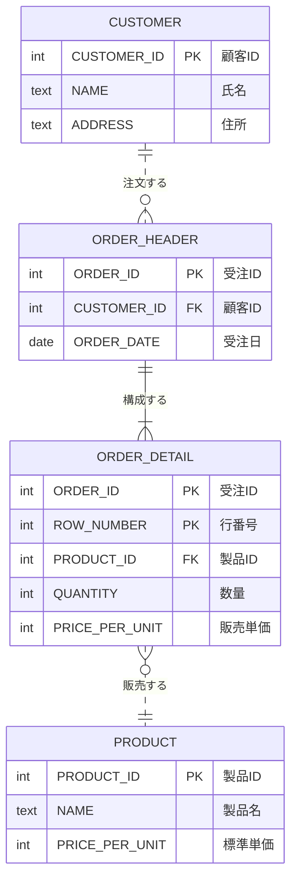
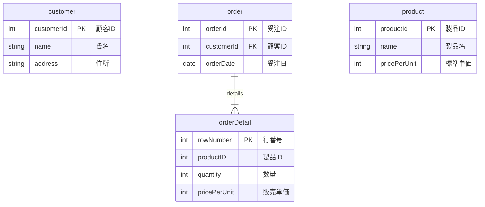

# はじめに
当社では、クラウドネイティブなSaaSの開発をしており、いつもはWebAPIの実装ならサーバーレスで。となるのですが、今回は、サーバーレスでないWebAPIの実現方法として、NestJSを動かしてみましたという内容です。

## やりたいこと
こんな感じのよくありそうなデータベースのテーブルを


こんな感じのRESTリソースとして公開したい。とします。


# やったこと
## NestJSの導入
```bash
$ node --version
v16.19.1
$ npm --version
8.19.2
$ npm i -g @nestjs/cli
$ nest --version
9.3.0
$ nest new nestjs-sample
? Which package manager would you ❤️  to use? npm
🚀  Successfully created project nestjs-sample
```
別件で使用中の環境ですが、なんの問題もありませんでした。

### 確認
```bash
$ npm run start
```
で起動して、別のターミナルから

```bash
$ curl http://localhost:3000/
Hello World!
```
おお、何もしてないけど動く。素敵です。

## CRUD generator
どんな感じで構成するのが良いのかしらと本家のサイトを見ているとありました。

https://docs.nestjs.com/recipes/crud-generator

やってみます。
```bash
$ nest g resource customers
? What transport layer do you use? REST API
? Would you like to generate CRUD entry points? Yes
✔ Packages installed successfully.
```

### 確認
こんな感じで customers 以下にファイルが生成されて、app.module に追加されました。
```bash
$ tree src
src
├── app.controller.spec.ts
├── app.controller.ts
├── app.module.ts
├── app.service.ts
├── customers
│   ├── customers.controller.spec.ts
│   ├── customers.controller.ts
│   ├── customers.module.ts
│   ├── customers.service.spec.ts
│   ├── customers.service.ts
│   ├── dto
│   │   ├── create-customer.dto.ts
│   │   └── update-customer.dto.ts
│   └── entities
│       └── customer.entity.ts
└── main.ts
```

```bash
$ npm run start
```
で起動して、また、別のターミナルから

```bash
$ curl http://localhost:3000/customers
This action returns all customers
```
まだ、なにもしていないけど、ちゃんとルーティングされている。👏

# 次回は

データベースを作って繋ぎます。

https://zenn.dev/robon/articles/32bf49163826ca
