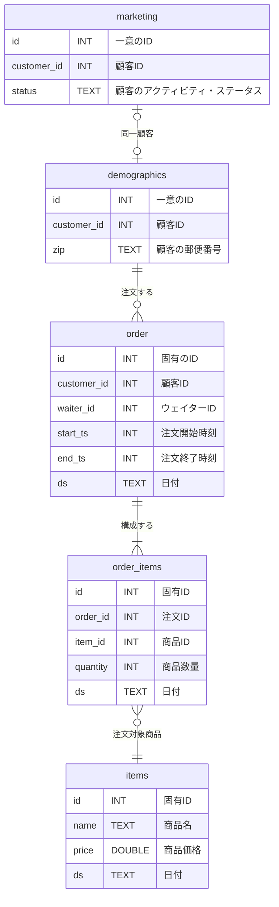
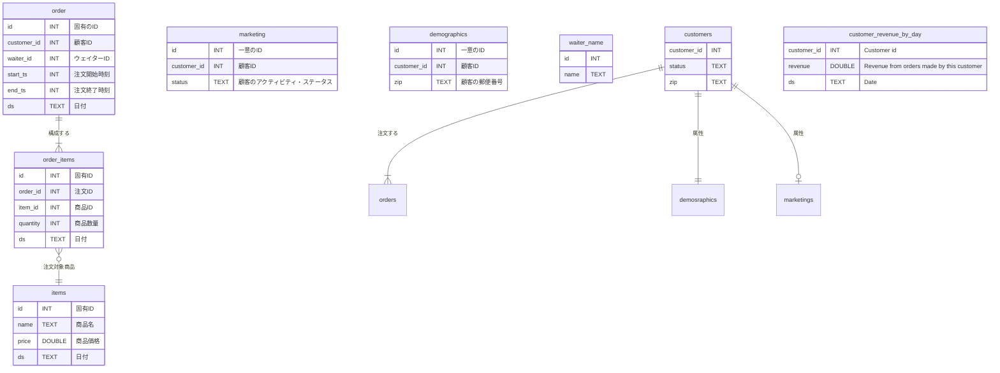

# はじめに
少し前の「[SQLMesh入門](https://zenn.dev/robon/articles/c8928f88f62218)」の「おわりに」でこんなことを書きました。
> 公式サイトを含めて、サンプルやトレーニング用の教材が少なく、作者の意図がわかりにくいように思います。

いろいろ探した結果、公式のリポジトリの「これ↓」が、いいんじゃないかな？ということで紹介してみます。

https://github.com/TobikoData/sqlmesh-examples

# やってみた
まず、このサンプルの背景ですが、寿司レストランのデータを分析するというユースケースです。Tobiko 社の名前は寿司ネタのトビコとのことです。

## 外部モデル
業務システムから以下の５つのテーブルが「raw」スキーマにロードされているところからスタートします。



顧客は２つに分かれてますけど、来店したら status が ACTIVE になったり、引っ越したら zip が変わったりするので管理しているシステムが違うのかもしれません。
order と order_item は、トランザクションなので、日々追加されていきます。
お寿司のネタなので、items は、時価ということで、これも日々追加されていくというシナリオなのでしょう。

これらは外部モデルなので、`external_models.yaml` でテーブル名、カラム名、データ型を定義しています。

```yaml: external_models.yaml
- name: raw.demographics
  columns:
    id: INT
    customer_id: INT
    zip: TEXT
- name: raw.items
  columns:
    id: INT
    name: TEXT
    price: DOUBLE
    ds: TEXT
- name: raw.marketing
  columns:
    id: INT
    customer_id: INT
    status: TEXT
- name: raw.order_items
  columns:
    id: INT
    order_id: INT
    item_id: INT
    quantity: INT
    ds: TEXT
- name: raw.orders
  columns:
    id: INT
    customer_id: INT
    waiter_id: INT
    start_ts: INT
    end_ts: INT
    ds: TEXT
```

## モデル
### waiter_names
order.waiter_id ですが、こちらは SEED のサンプルになってます。

```sql: models/waiter_names.sql
-- Seed data containing water names.
MODEL (
  name sushisimple.waiter_names,
  kind SEED (
    path '../seeds/waiter_names.csv'
  ),
  columns (
    id INT,
    name TEXT
  ),
  grain id
)
```
```csv: seeds/waiter_names.csv
id,name
0,Toby
1,Tyson
2,Ryan
3,George
4,Chris
5,Max
6,Vincent
7,Iaroslav
8,Emma
9,Maia
```

### customers
やはり customer が割れているのはイマイチなので、orders してくれた顧客を VIEW で用意します。

```sql: models/customer.sql
-- View of customer data.
MODEL (
  name sushisimple.customers,
  kind VIEW,
  cron '@daily',
  grain customer_id,
);

SELECT DISTINCT
  o.customer_id::INT AS customer_id,
  COALESCE(m.status, 'UNKNOWN')::TEXT AS status,
  d.zip::TEXT as zip
FROM raw.orders AS o
LEFT JOIN raw.marketing AS m
    ON o.customer_id = m.customer_id
LEFT JOIN raw.demographics AS d
    ON o.customer_id = d.customer_id
```

### customer_revenue_by_day
顧客あたり、日別の売り上げを VIEW で求めます。CTE で order_total を求めてから、日別、顧客別の合計を作ります。

```sql: models/customer_revenue_by_day.sql
-- View of revenue from customers by day.
MODEL (
  name sushisimple.customer_revenue_by_day,
  kind VIEW,
  cron '@daily',
  grain (customer_id, ds),
);

WITH order_total AS (
  SELECT
    oi.order_id AS order_id,
    SUM(oi.quantity * i.price) AS total,
    oi.ds AS ds
  FROM raw.order_items AS oi
  LEFT JOIN raw.items AS i
    ON oi.item_id = i.id AND oi.ds = i.ds
  GROUP BY
    oi.order_id,
    oi.ds
)
SELECT
  o.customer_id::INT AS customer_id, /* Customer id */
  SUM(ot.total)::DOUBLE AS revenue, /* Revenue from orders made by this customer */
  o.ds::TEXT AS ds /* Date */
FROM raw.orders AS o
LEFT JOIN order_total AS ot
  ON o.id = ot.order_id AND o.ds = ot.ds
GROUP BY
  o.customer_id,
  o.ds
```

### waiter_revenue_by_day
こちらはウェイターさんあたりですが、CTE なしです。さっきのは、CTE のサンプルを作りたかったのでしょう。

```sql: models/water_revenue_by_day.sql
-- View of revenue generated by each waiter by day.
MODEL (
  name sushisimple.waiter_revenue_by_day,
  kind VIEW,
  cron '@daily',
  grain (waiter_id, ds)
);

SELECT
  o.waiter_id::INT AS waiter_id, -- Waiter id
  SUM(oi.quantity * i.price)::DOUBLE AS revenue, -- Revenue from orders taken by this waiter
  o.ds::TEXT AS ds -- Order date
FROM raw.orders AS o
LEFT JOIN raw.order_items AS oi
  ON o.id = oi.order_id AND o.ds = oi.ds
LEFT JOIN raw.items AS i
  ON oi.item_id = i.id AND oi.ds = i.ds
GROUP BY
  o.waiter_id,
  o.ds
```

### top_waiters
直近の日付のウェイター別売り上げトップ10です。

```sql: models/top_waiters.sql
-- View of 10 waiters with highest revenue on most recent day of data.
MODEL (
  name sushisimple.top_waiters,
  kind VIEW,
  cron '@daily',
  grain waiter_id
);

SELECT
  waiter_id::INT AS waiter_id,
  name::TEXT AS waiter_name,
  revenue::DOUBLE AS revenue
FROM sushisimple.waiter_revenue_by_day as r
LEFT JOIN sushisimple.waiter_names AS n
  ON r.waiter_id = n.id
WHERE
  ds = (
    SELECT
      MAX(ds)
    FROM sushisimple.waiter_revenue_by_day
  )
ORDER BY
  revenue DESC
LIMIT 10
```

### ERD



# おわりに

