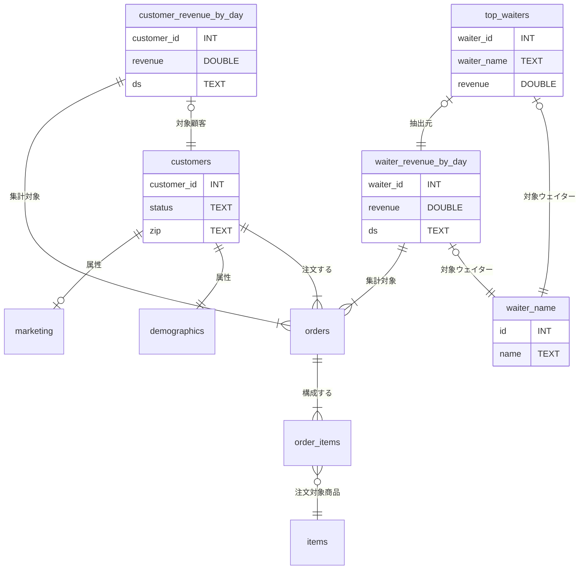
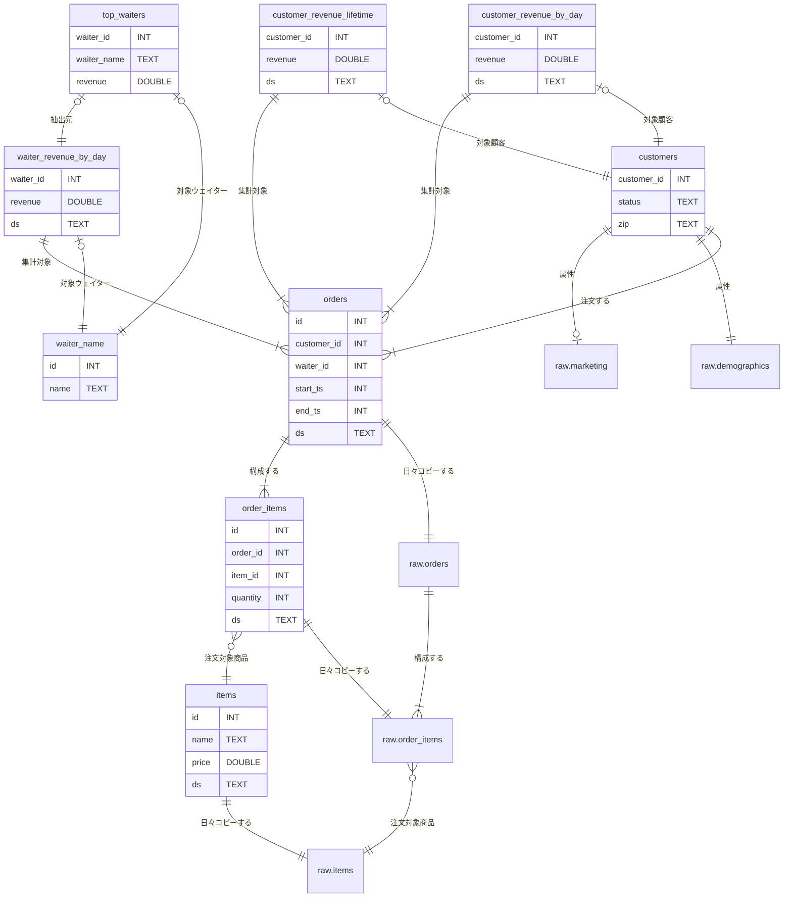

# はじめに
少し前の「[SQLMesh入門](https://zenn.dev/robon/articles/c8928f88f62218)」の「おわりに」でこんなことを書きました。
> 公式サイトを含めて、サンプルやトレーニング用の教材が少なく、作者の意図がわかりにくいように思います。

いろいろ探した結果、公式のリポジトリの「これ↓」が、いいんじゃないかな？
ということで紹介してみます。

https://github.com/TobikoData/sqlmesh-examples

# やってみた（001_shushi/1_simple）
まず、このサンプルの背景ですが、寿司レストランのデータを分析するというユースケースです。Tobiko 社の名前は寿司ネタのトビコとのことです。

## 外部モデル
業務システムから以下の５つのテーブルが「raw」スキーマにロードされているところからスタートします。


顧客は２つに分かれてますけど、来店したら `status` が `ACTIVE` になったり、引っ越したら `zip` が変わったりするので管理しているシステムが違うのかもしれません。
`orders` テーブルと `order_item` テーブルは、トランザクションなので、業務ではリアルタイムで、DWH には一定間隔で追加されていくと考えてよさそうです。
お寿司のネタなので、`items` テーブルの `price` の値は、時価ということで、これも日々追加されていくというシナリオなのでしょう。

これらは外部モデルなので、`external_models.yaml` でテーブル名、カラム名、データ型を定義しています。コメントは、[sushi-overview.ipynb](https://github.com/TobikoData/sqlmesh-examples/blob/main/001_sushi/sushi-overview.ipynb) のものを意訳しました。

```yaml: external_models.yaml
- name: raw.demographics
  columns:
    id: INT
    customer_id: INT
    zip: TEXT
- name: raw.items
  columns:
    id: INT
    name: TEXT
    price: DOUBLE
    ds: TEXT
- name: raw.marketing
  columns:
    id: INT
    customer_id: INT
    status: TEXT
- name: raw.order_items
  columns:
    id: INT
    order_id: INT
    item_id: INT
    quantity: INT
    ds: TEXT
- name: raw.orders
  columns:
    id: INT
    customer_id: INT
    waiter_id: INT
    start_ts: INT
    end_ts: INT
    ds: TEXT
```

## モデル
### waiter_names
`order.waiter_id` として（おそらく業務システム上は社員マスターのものが）参照されていますが、こちらは（限定されたウェイターさんだけが対象ということか） SEED のサンプルになってます。

```sql: models/waiter_names.sql
-- Seed data containing water names.
MODEL (
  name sushisimple.waiter_names,
  kind SEED (
    path '../seeds/waiter_names.csv'
  ),
  columns (
    id INT,
    name TEXT
  ),
  grain id
)
```
```csv: seeds/waiter_names.csv
id,name
0,Toby
1,Tyson
2,Ryan
3,George
4,Chris
5,Max
6,Vincent
7,Iaroslav
8,Emma
9,Maia
```

### customers
やはり `customers` が割れているのはイマイチなので、`orders` してくれた顧客を VIEW で用意しています。

```sql: models/customer.sql
-- View of customer data.
MODEL (
  name sushisimple.customers,
  kind VIEW,
  cron '@daily',
  grain customer_id,
);

SELECT DISTINCT
  o.customer_id::INT AS customer_id,
  COALESCE(m.status, 'UNKNOWN')::TEXT AS status,
  d.zip::TEXT as zip
FROM raw.orders AS o
LEFT JOIN raw.marketing AS m
    ON o.customer_id = m.customer_id
LEFT JOIN raw.demographics AS d
    ON o.customer_id = d.customer_id
```

### customer_revenue_by_day
顧客あたり、日別の売り上げを VIEW で求めます。CTE で `order_total` を求めてから、日別、顧客別の合計を作ります。

```sql: models/customer_revenue_by_day.sql
-- View of revenue from customers by day.
MODEL (
  name sushisimple.customer_revenue_by_day,
  kind VIEW,
  cron '@daily',
  grain (customer_id, ds),
);

WITH order_total AS (
  SELECT
    oi.order_id AS order_id,
    SUM(oi.quantity * i.price) AS total,
    oi.ds AS ds
  FROM raw.order_items AS oi
  LEFT JOIN raw.items AS i
    ON oi.item_id = i.id AND oi.ds = i.ds
  GROUP BY
    oi.order_id,
    oi.ds
)
SELECT
  o.customer_id::INT AS customer_id, /* Customer id */
  SUM(ot.total)::DOUBLE AS revenue, /* Revenue from orders made by this customer */
  o.ds::TEXT AS ds /* Date */
FROM raw.orders AS o
LEFT JOIN order_total AS ot
  ON o.id = ot.order_id AND o.ds = ot.ds
GROUP BY
  o.customer_id,
  o.ds
```

### waiter_revenue_by_day
こちらはウェイターさんあたりの売り上げですが、CTE なしです。さっきのは、顧客が多いという想定か、CTE のサンプルを作りたかったのかもしれませんね。再利用するなら `order_total` も VIEW でモデルにしておくのもありでしょう。

```sql: models/water_revenue_by_day.sql
-- View of revenue generated by each waiter by day.
MODEL (
  name sushisimple.waiter_revenue_by_day,
  kind VIEW,
  cron '@daily',
  grain (waiter_id, ds)
);

SELECT
  o.waiter_id::INT AS waiter_id, -- Waiter id
  SUM(oi.quantity * i.price)::DOUBLE AS revenue, -- Revenue from orders taken by this waiter
  o.ds::TEXT AS ds -- Order date
FROM raw.orders AS o
LEFT JOIN raw.order_items AS oi
  ON o.id = oi.order_id AND o.ds = oi.ds
LEFT JOIN raw.items AS i
  ON oi.item_id = i.id AND oi.ds = i.ds
GROUP BY
  o.waiter_id,
  o.ds
```

### top_waiters
直近の日付のウェイター別売り上げトップ10です。

```sql: models/top_waiters.sql
-- View of 10 waiters with highest revenue on most recent day of data.
MODEL (
  name sushisimple.top_waiters,
  kind VIEW,
  cron '@daily',
  grain waiter_id
);

SELECT
  waiter_id::INT AS waiter_id,
  name::TEXT AS waiter_name,
  revenue::DOUBLE AS revenue
FROM sushisimple.waiter_revenue_by_day as r
LEFT JOIN sushisimple.waiter_names AS n
  ON r.waiter_id = n.id
WHERE
  ds = (
    SELECT
      MAX(ds)
    FROM sushisimple.waiter_revenue_by_day
  )
ORDER BY
  revenue DESC
LIMIT 10
```

### ERD
まぁ、積み重ねた VIEW なので、なんちゃって ER 図ですが。



## 動かす前に
### Setup
[README.md](https://github.com/TobikoData/sqlmesh-examples/blob/main/README.md) の `Setup` のようにやっても良いのですが、最近は、すっかり `uv` 派なので、`uv` 前提でセットアップします。

```
cd sqlmesh-examples
uv init --bare
uv venv
uv add sqlmesh
```

### DuckDB
まさに、動かす前に、DuckDB の中身を確認しておきます。
```
$ duckdb 001_sushi/1_simple/db/sushi-example.db 
v1.2.1 8e52ec4395
Enter ".help" for usage hints.
D select database_name  from duckdb_databases() where internal = false;
┌───────────────┐
│ database_name │
│    varchar    │
├───────────────┤
│ sushi-example │
└───────────────┘
D select schema_name from duckdb_schemas() where database_name = 'sushi-example';
┌─────────────┐
│ schema_name │
│   varchar   │
├─────────────┤
│ main        │
│ raw         │
└─────────────┘
D select table_name from duckdb_tables() where schema_name = 'raw';
┌──────────────┐
│  table_name  │
│   varchar    │
├──────────────┤
│ demographics │
│ items        │
│ marketing    │
│ orders       │
│ order_items  │
└──────────────┘
D select view_name from duckdb_views() where schema_name = 'raw';
┌───────────┐
│ view_name │
│  varchar  │
├───────────┤
│  0 rows   │
└───────────┘
D select table_name, column_name, comment, data_type from duckdb_columns() where schema_name = 'raw';
┌──────────────┬─────────────┬─────────┬───────────┐
│  table_name  │ column_name │ comment │ data_type │
│   varchar    │   varchar   │ varchar │  varchar  │
├──────────────┼─────────────┼─────────┼───────────┤
│ demographics │ id          │ NULL    │ INTEGER   │
│ demographics │ customer_id │ NULL    │ INTEGER   │
│ demographics │ zip         │ NULL    │ VARCHAR   │
│ items        │ id          │ NULL    │ INTEGER   │
│ items        │ name        │ NULL    │ VARCHAR   │
│ items        │ price       │ NULL    │ DOUBLE    │
│ items        │ ds          │ NULL    │ DATE      │
│ marketing    │ id          │ NULL    │ INTEGER   │
│ marketing    │ customer_id │ NULL    │ INTEGER   │
│ marketing    │ status      │ NULL    │ VARCHAR   │
│ orders       │ id          │ NULL    │ INTEGER   │
│ orders       │ customer_id │ NULL    │ INTEGER   │
│ orders       │ waiter_id   │ NULL    │ INTEGER   │
│ orders       │ start_ts    │ NULL    │ INTEGER   │
│ orders       │ end_ts      │ NULL    │ INTEGER   │
│ orders       │ ds          │ NULL    │ DATE      │
│ order_items  │ id          │ NULL    │ INTEGER   │
│ order_items  │ order_id    │ NULL    │ INTEGER   │
│ order_items  │ item_id     │ NULL    │ INTEGER   │
│ order_items  │ quantity    │ NULL    │ INTEGER   │
│ order_items  │ ds          │ NULL    │ DATE      │
├──────────────┴─────────────┴─────────┴───────────┤
│ 21 rows                                4 columns │
└──────────────────────────────────────────────────┘
D .q
```

## 動かす
### sqlmesh plan
`config.yaml` のあるプロジェクトへ移動して、`sqlmesh plan` します。

```
$ cd 001_sushi/1_simple/
$ uv run sqlmesh plan
Initializing new project state...

`prod` environment will be initialized

Models:
└── Added:
    ├── raw.demographics
    ├── raw.items
    ├── raw.marketing
    ├── raw.order_items
    ├── raw.orders
    ├── sushisimple.customer_revenue_by_day
    ├── sushisimple.customers
    ├── sushisimple.top_waiters
    ├── sushisimple.waiter_names
    └── sushisimple.waiter_revenue_by_day
Models needing backfill:
├── sushisimple.customer_revenue_by_day: [recreate view]
├── sushisimple.customers: [recreate view]
├── sushisimple.top_waiters: [recreate view]
├── sushisimple.waiter_names: [full refresh]
└── sushisimple.waiter_revenue_by_day: [recreate view]
Apply - Backfill Tables [y/n]: y
[1/1] sushisimple.customer_revenue_by_day   [recreate view]                               0.04s   
[1/1] sushisimple.customers                 [recreate view]                               0.03s   
[1/1] sushisimple.waiter_names              [insert seed file]                            0.04s   
[1/1] sushisimple.waiter_revenue_by_day     [recreate view]                               0.04s   
[1/1] sushisimple.top_waiters               [recreate view]                               0.03s   
Executing model batches ━━━━━━━━━━━━━━━━━━━━━━━━━━━━━━━━━━━━━━━━ 100.0% • 5/5 • 0:00:00                                                           
                                                                                                                                                  
✔ Model batches executed

Updating virtual layer  ━━━━━━━━━━━━━━━━━━━━━━━━━━━━━━━━━━━━━━━━ 100.0% • 5/5 • 0:00:00

✔ Virtual layer updated

```

### DuckDB
「動かす前に」と同様に上から
```
$ duckdb db/sushi-example.db 
v1.2.1 8e52ec4395
Enter ".help" for usage hints.
D select schema_name from duckdb_schemas() where database_name = 'sushi-example';
┌──────────────────────┐
│     schema_name      │
│       varchar        │
├──────────────────────┤
│ main                 │
│ raw                  │
│ sqlmesh              │
│ sqlmesh__sushisimple │
│ sushisimple          │
└──────────────────────┘
D select schema_name, table_name from duckdb_tables() where schema_name <> 'main';
┌──────────────────────┬───────────────────────────────────────┐
│     schema_name      │              table_name               │
│       varchar        │                varchar                │
├──────────────────────┼───────────────────────────────────────┤
│ raw                  │ demographics                          │
│ raw                  │ items                                 │
│ raw                  │ marketing                             │
│ raw                  │ orders                                │
│ raw                  │ order_items                           │
│ sqlmesh              │ _auto_restatements                    │
│ sqlmesh              │ _environments                         │
│ sqlmesh              │ _environment_statements               │
│ sqlmesh              │ _intervals                            │
│ sqlmesh              │ _snapshots                            │
│ sqlmesh              │ _versions                             │
│ sqlmesh__sushisimple │ sushisimple__waiter_names__3510154461 │
├──────────────────────┴───────────────────────────────────────┤
│ 12 rows                                            2 columns │
└──────────────────────────────────────────────────────────────┘
D select schema_name, view_name from duckdb_views() where database_name = 'sushi-example' and schema_name <> 'main';
┌──────────────────────┬──────────────────────────────────────────────────┐
│     schema_name      │                    view_name                     │
│       varchar        │                     varchar                      │
├──────────────────────┼──────────────────────────────────────────────────┤
│ sqlmesh__sushisimple │ sushisimple__customers__417166203                │
│ sqlmesh__sushisimple │ sushisimple__customer_revenue_by_day__1188378195 │
│ sqlmesh__sushisimple │ sushisimple__top_waiters__381189255              │
│ sqlmesh__sushisimple │ sushisimple__waiter_revenue_by_day__157094348    │
│ sushisimple          │ customers                                        │
│ sushisimple          │ customer_revenue_by_day                          │
│ sushisimple          │ top_waiters                                      │
│ sushisimple          │ waiter_names                                     │
│ sushisimple          │ waiter_revenue_by_day                            │
└──────────────────────┴──────────────────────────────────────────────────┘
D select table_name, column_name, comment, data_type from duckdb_columns() where schema_name = 'sqlmesh__sushisimple';
┌──────────────────────────────────────────────────┬─────────────┬───────────────────────────────────────────┬───────────┐
│                    table_name                    │ column_name │                  comment                  │ data_type │
│                     varchar                      │   varchar   │                  varchar                  │  varchar  │
├──────────────────────────────────────────────────┼─────────────┼───────────────────────────────────────────┼───────────┤
│ sushisimple__customers__417166203                │ customer_id │ NULL                                      │ INTEGER   │
│ sushisimple__customers__417166203                │ status      │ NULL                                      │ VARCHAR   │
│ sushisimple__customers__417166203                │ zip         │ NULL                                      │ VARCHAR   │
│ sushisimple__customer_revenue_by_day__1188378195 │ customer_id │ Customer id                               │ INTEGER   │
│ sushisimple__customer_revenue_by_day__1188378195 │ revenue     │ Revenue from orders made by this customer │ DOUBLE    │
│ sushisimple__customer_revenue_by_day__1188378195 │ ds          │ Date                                      │ VARCHAR   │
│ sushisimple__top_waiters__381189255              │ waiter_id   │ NULL                                      │ INTEGER   │
│ sushisimple__top_waiters__381189255              │ waiter_name │ NULL                                      │ VARCHAR   │
│ sushisimple__top_waiters__381189255              │ revenue     │ NULL                                      │ DOUBLE    │
│ sushisimple__waiter_names__3510154461            │ id          │ NULL                                      │ INTEGER   │
│ sushisimple__waiter_names__3510154461            │ name        │ NULL                                      │ VARCHAR   │
│ sushisimple__waiter_revenue_by_day__157094348    │ waiter_id   │ Waiter id                                 │ INTEGER   │
│ sushisimple__waiter_revenue_by_day__157094348    │ revenue     │ Revenue from orders taken by this waiter  │ DOUBLE    │
│ sushisimple__waiter_revenue_by_day__157094348    │ ds          │ Order date                                │ VARCHAR   │
├──────────────────────────────────────────────────┴─────────────┴───────────────────────────────────────────┴───────────┤
│ 14 rows                                                                                                      4 columns │
└────────────────────────────────────────────────────────────────────────────────────────────────────────────────────────┘
D select table_name, column_name, comment, data_type from duckdb_columns() where schema_name = 'sushisimple';
┌─────────────────────────┬─────────────┬───────────────────────────────────────────┬───────────┐
│       table_name        │ column_name │                  comment                  │ data_type │
│         varchar         │   varchar   │                  varchar                  │  varchar  │
├─────────────────────────┼─────────────┼───────────────────────────────────────────┼───────────┤
│ customers               │ customer_id │ NULL                                      │ INTEGER   │
│ customers               │ status      │ NULL                                      │ VARCHAR   │
│ customers               │ zip         │ NULL                                      │ VARCHAR   │
│ customer_revenue_by_day │ customer_id │ Customer id                               │ INTEGER   │
│ customer_revenue_by_day │ revenue     │ Revenue from orders made by this customer │ DOUBLE    │
│ customer_revenue_by_day │ ds          │ Date                                      │ VARCHAR   │
│ top_waiters             │ waiter_id   │ NULL                                      │ INTEGER   │
│ top_waiters             │ waiter_name │ NULL                                      │ VARCHAR   │
│ top_waiters             │ revenue     │ NULL                                      │ DOUBLE    │
│ waiter_names            │ id          │ NULL                                      │ INTEGER   │
│ waiter_names            │ name        │ NULL                                      │ VARCHAR   │
│ waiter_revenue_by_day   │ waiter_id   │ Waiter id                                 │ INTEGER   │
│ waiter_revenue_by_day   │ revenue     │ Revenue from orders taken by this waiter  │ DOUBLE    │
│ waiter_revenue_by_day   │ ds          │ Order date                                │ VARCHAR   │
├─────────────────────────┴─────────────┴───────────────────────────────────────────┴───────────┤
│ 14 rows                                                                             4 columns │
└───────────────────────────────────────────────────────────────────────────────────────────────┘
D .q
```

上から順に、
スキーマは３つ追加されました。
- `sqlmesh` は、sqlmesh の状態データベースです。
- `sqlmesh__sushisimple` は、`sushisimple` プロジェクトの物理レイヤです。
- `suchisimple` は、`prod` 環境の論理レイヤです。

テーブルは、状態データベースに６つ、物理レイヤに SEED の `waiter_names` に相当するものが１つ追加されました。状態データベースは、後から、詳細をみることにします。

ビューは、それぞれモデルに相当するものが、物理レイヤに４つ、論理レイヤに５つ追加されました。物理レイヤが１つ少ないのは、１つが SEED でテーブルになっているからです。

次に、物理レイヤのカラムですが、こちらはモデルのとおりです。モデルのカラムにインラインでコメントされていた内容が、DuckDB のカラムコメントにも残されています。

最後は、論理レイヤのカラムですが、物理レイヤの別名の関係になりますので、コメントを含めて同じです。

### 状態データベース
状態データベースの６つのテーブルについて見ていきましょう。

#### _auto_restatements
この時点では空でした。
```
D select * from sqlmesh._auto_restatements;
┌───────────────┬──────────────────┬──────────────────────────┐
│ snapshot_name │ snapshot_version │ next_auto_restatement_ts │
│    varchar    │     varchar      │          int64           │
├───────────────┴──────────────────┴──────────────────────────┤
│                           0 rows                            │
└─────────────────────────────────────────────────────────────┘
```

#### _environments
1レコードですが、15カラムあるので、CSV に export して、転置します。export は、以下のようにやります。
```
D copy sqlmesh._environments to '_environments.csv' (header, delimiter ',');
```

| 項目 | 値 |
|---|---|
| name | prod |
| snapshots | 長い JSON 文字列なので、下記へ |
| start_at | 2025-10-07 00:00:00 |
| end_at |  |
| plan_id | 0d2e4bf9844c4407a00230429f4a47c2 |
| previous_plan_id |  |
| expiration_ts |  |
| finalized_ts | 1759890044886 |
| promoted_snapshot_ids |  |
| suffix_target | schema |
| catalog_name_override |  |
| previous_finalized_snapshots | [] |
| normalize_name | true |
| requirements | {} |
| gateway_managed | false |

```json: _environments.snapshots
[
  {
    "name": "\"sushi-example\".\"sushisimple\".\"customers\"",
    "dev_version": "417166203",
    "change_category": 1,
    "fingerprint": {
      "data_hash": "3649155621",
      "metadata_hash": "54374572",
      "parent_data_hash": "3540115527",
      "parent_metadata_hash": "36623728"
    },
    "previous_versions": [],
    "dev_table_suffix": "dev",
    "table_naming_convention": "schema_and_table",
    "forward_only": false,
    "version": "417166203",
    "physical_schema": "sqlmesh__sushisimple",
    "parents": [
      {
        "name": "\"sushi-example\".\"raw\".\"demographics\"",
        "identifier": "1112628036"
      },
      {
        "name": "\"sushi-example\".\"raw\".\"orders\"",
        "identifier": "4177358286"
      },
      {
        "name": "\"sushi-example\".\"raw\".\"marketing\"",
        "identifier": "951266748"
      }
    ],
    "kind_name": "VIEW",
    "node_type": "model",
    "virtual_environment_mode": "full"
  },
  {
    "name": "\"sushi-example\".\"sushisimple\".\"waiter_revenue_by_day\"",
    "dev_version": "157094348",
    "change_category": 1,
    "fingerprint": {
      "data_hash": "1974234594",
      "metadata_hash": "338732671",
      "parent_data_hash": "2615392153",
      "parent_metadata_hash": "36623728"
    },
    "previous_versions": [],
    "dev_table_suffix": "dev",
    "table_naming_convention": "schema_and_table",
    "forward_only": false,
    "version": "157094348",
    "physical_schema": "sqlmesh__sushisimple",
    "parents": [
      {
        "name": "\"sushi-example\".\"raw\".\"orders\"",
        "identifier": "4177358286"
      },
      {
        "name": "\"sushi-example\".\"raw\".\"items\"",
        "identifier": "4057945501"
      },
      {
        "name": "\"sushi-example\".\"raw\".\"order_items\"",
        "identifier": "2963435990"
      }
    ],
    "kind_name": "VIEW",
    "node_type": "model",
    "virtual_environment_mode": "full"
  },
  {
    "name": "\"sushi-example\".\"sushisimple\".\"waiter_names\"",
    "dev_version": "3510154461",
    "change_category": 1,
    "fingerprint": {
      "data_hash": "4220286235",
      "metadata_hash": "1646615025",
      "parent_data_hash": "0",
      "parent_metadata_hash": "0"
    },
    "previous_versions": [],
    "dev_table_suffix": "dev",
    "table_naming_convention": "schema_and_table",
    "forward_only": false,
    "version": "3510154461",
    "physical_schema": "sqlmesh__sushisimple",
    "parents": [],
    "kind_name": "SEED",
    "node_type": "model",
    "virtual_environment_mode": "full"
  },
  {
    "name": "\"sushi-example\".\"sushisimple\".\"customer_revenue_by_day\"",
    "dev_version": "1188378195",
    "change_category": 1,
    "fingerprint": {
      "data_hash": "1699790014",
      "metadata_hash": "3913364503",
      "parent_data_hash": "2615392153",
      "parent_metadata_hash": "36623728"
    },
    "previous_versions": [],
    "dev_table_suffix": "dev",
    "table_naming_convention": "schema_and_table",
    "forward_only": false,
    "version": "1188378195",
    "physical_schema": "sqlmesh__sushisimple",
    "parents": [
      {
        "name": "\"sushi-example\".\"raw\".\"orders\"",
        "identifier": "4177358286"
      },
      {
        "name": "\"sushi-example\".\"raw\".\"items\"",
        "identifier": "4057945501"
      },
      {
        "name": "\"sushi-example\".\"raw\".\"order_items\"",
        "identifier": "2963435990"
      }
    ],
    "kind_name": "VIEW",
    "node_type": "model",
    "virtual_environment_mode": "full"
  },
  {
    "name": "\"sushi-example\".\"sushisimple\".\"top_waiters\"",
    "dev_version": "381189255",
    "change_category": 1,
    "fingerprint": {
      "data_hash": "2591817560",
      "metadata_hash": "460664824",
      "parent_data_hash": "1999905133",
      "parent_metadata_hash": "737318949"
    },
    "previous_versions": [],
    "dev_table_suffix": "dev",
    "table_naming_convention": "schema_and_table",
    "forward_only": false,
    "version": "381189255",
    "physical_schema": "sqlmesh__sushisimple",
    "parents": [
      {
        "name": "\"sushi-example\".\"sushisimple\".\"waiter_revenue_by_day\"",
        "identifier": "2200766198"
      },
      {
        "name": "\"sushi-example\".\"sushisimple\".\"waiter_names\"",
        "identifier": "1509510622"
      }
    ],
    "kind_name": "VIEW",
    "node_type": "model",
    "virtual_environment_mode": "full"
  },
  {
    "name": "\"sushi-example\".\"raw\".\"demographics\"",
    "dev_version": "3906394976",
    "change_category": 1,
    "fingerprint": {
      "data_hash": "2544791803",
      "metadata_hash": "1551791906",
      "parent_data_hash": "0",
      "parent_metadata_hash": "0"
    },
    "previous_versions": [],
    "dev_table_suffix": "dev",
    "table_naming_convention": "schema_and_table",
    "forward_only": false,
    "version": "3906394976",
    "physical_schema": "sqlmesh__raw",
    "parents": [],
    "kind_name": "EXTERNAL",
    "node_type": "model",
    "virtual_environment_mode": "full"
  },
  {
    "name": "\"sushi-example\".\"raw\".\"items\"",
    "dev_version": "3791312541",
    "change_category": 1,
    "fingerprint": {
      "data_hash": "1248473033",
      "metadata_hash": "1551791906",
      "parent_data_hash": "0",
      "parent_metadata_hash": "0"
    },
    "previous_versions": [],
    "dev_table_suffix": "dev",
    "table_naming_convention": "schema_and_table",
    "forward_only": false,
    "version": "3791312541",
    "physical_schema": "sqlmesh__raw",
    "parents": [],
    "kind_name": "EXTERNAL",
    "node_type": "model",
    "virtual_environment_mode": "full"
  },
  {
    "name": "\"sushi-example\".\"raw\".\"marketing\"",
    "dev_version": "1833826140",
    "change_category": 1,
    "fingerprint": {
      "data_hash": "3084179100",
      "metadata_hash": "1551791906",
      "parent_data_hash": "0",
      "parent_metadata_hash": "0"
    },
    "previous_versions": [],
    "dev_table_suffix": "dev",
    "table_naming_convention": "schema_and_table",
    "forward_only": false,
    "version": "1833826140",
    "physical_schema": "sqlmesh__raw",
    "parents": [],
    "kind_name": "EXTERNAL",
    "node_type": "model",
    "virtual_environment_mode": "full"
  },
  {
    "name": "\"sushi-example\".\"raw\".\"order_items\"",
    "dev_version": "490972095",
    "change_category": 1,
    "fingerprint": {
      "data_hash": "1013284553",
      "metadata_hash": "1551791906",
      "parent_data_hash": "0",
      "parent_metadata_hash": "0"
    },
    "previous_versions": [],
    "dev_table_suffix": "dev",
    "table_naming_convention": "schema_and_table",
    "forward_only": false,
    "version": "490972095",
    "physical_schema": "sqlmesh__raw",
    "parents": [],
    "kind_name": "EXTERNAL",
    "node_type": "model",
    "virtual_environment_mode": "full"
  },
  {
    "name": "\"sushi-example\".\"raw\".\"orders\"",
    "dev_version": "3608433385",
    "change_category": 1,
    "fingerprint": {
      "data_hash": "2091497075",
      "metadata_hash": "1551791906",
      "parent_data_hash": "0",
      "parent_metadata_hash": "0"
    },
    "previous_versions": [],
    "dev_table_suffix": "dev",
    "table_naming_convention": "schema_and_table",
    "forward_only": false,
    "version": "3608433385",
    "physical_schema": "sqlmesh__raw",
    "parents": [],
    "kind_name": "EXTERNAL",
    "node_type": "model",
    "virtual_environment_mode": "full"
  }
]
```

ソースコード上は、[environment.py](https://github.com/TobikoData/sqlmesh/blob/main/sqlmesh/core/environment.py) で、いわゆる SQLMesh の環境で、物理テーブルへのポインターを保有する目的のようです。

上記の `snapshots` を含め、構造のある項目の説明は以下のとおりです。
- `snapshots`: この環境に含まれるスナップショット。
- `promoted_snapshot_ids`: この環境でプロモートされたスナップショットのID（つまり、ビューが作成されたスナップショット）。
指定しない場合は、すべてのスナップショットがプロモートされます。
- `previous_finalized_snapshots`: この環境が最後にファイナライズされた際に含まれていたスナップショット。
- `requirements`: この環境内のすべてのスナップショットのライブラリバージョンのマッピング。

#### _environment_statements
この時点では空でした。
```
D select * from sqlmesh._environment_statements;
┌──────────────────┬─────────┬────────────────────────┐
│ environment_name │ plan_id │ environment_statements │
│     varchar      │ varchar │        varchar         │
├──────────────────┴─────────┴────────────────────────┤
│                       0 rows                        │
└─────────────────────────────────────────────────────┘
```

#### _intervals
5レコード、13カラムあるので、CSV に export して、転置します。

| 項目 | レコード1 | レコード2 | レコード3 | レコード4 | レコード5 | 
|---|---|---|---|---|---|
| id | 48043f05d82f4bbb8c48a128ef0b7ef4 | 172d7f9fdbde4fbfbb9c6a6ba9760647 | 88e57515c68b4a2e8fef78a7852cb9b7 | 8e301b2f6b3143bb97967873c5f8d0f4 | d2000416fb474fd8aaafa85f8b09626e |
| created_ts | 1759890044619 | 1759890044653 | 1759890044697 | 1759890044737 | 1759890044769 |
| name | "sushi-example".<br>"sushisimple".<br>"customer_revenue_by_day" | "sushi-example".<br>"sushisimple".<br>"customers" | "sushi-example".<br>"sushisimple".<br>"waiter_names" | "sushi-example".<br>"sushisimple".<br>"waiter_revenue_by_day" | "sushi-example".<br>"sushisimple".<br>"top_waiters" |
| identifier | 1954947422 | 3508720648 | 1509510622 | 2200766198 | 2818951582 |
| version | 1188378195 | 417166203 | 3510154461 | 157094348 | 381189255 |
| start_ts | 1759795200000 | 1759795200000 | 1759795200000 | 1759795200000 | 1759795200000 |
| end_ts | 1759881600000 | 1759881600000 | 1759881600000 | 1759881600000 | 1759881600000 |
| is_dev | false | false | false | false | false |
| is_removed | false | false | false | false | false |
| is_compacted | false | false | false | false | false |
| is_pending_restatement | false | false | false | false | false |
| dev_version | 1188378195 | 417166203 | 3510154461 | 157094348 | 381189255 |
| last_altered_ts | 1759890044618 | 1759890044653 | 1759890044697 | 1759890044736 | 1759890044769 |

レコード1 の UNIX Timestamp らしき値を変換すると、GMT では

- `created_ts`: 2025年10月8日 Wednesday 02:20:44.619
- `start_ts`: 2025年10月7日 Tuesday 00:00:00
- `end_ts`: 2025年10月8日 Wednesday 00:00:00
- `last_altered_ts`: 2025年10月8日 Wednesday 02:20:44.618

となって、今回のモデルは、全て `cron '@daily'` なので、実際に動かした日本時間の 10/8 11:20 から各値を算出しているようです。

#### _snapshots
10レコード、12カラムあるので、CSV に export して、転置して、折り返します。

| 項目 | レコード1 | レコード2 | レコード3 | レコード4 | レコード5 | 
|---|---|---|---|---|---| 
| name | "sushi-example".<br>"sushisimple".<br>"customers" | "sushi-example".<br>"sushisimple".<br>"waiter_revenue_by_day" | "sushi-example".<br>"sushisimple".<br>"waiter_names" | "sushi-example".<br>"sushisimple".<br>"customer_revenue_by_day" | "sushi-example".<br>"sushisimple".<br>"top_waiters" |
| identifier | 3508720648 | 2200766198 | 1509510622 | 1954947422 | 2818951582 |
| version | 417166203 | 157094348 | 3510154461 | 1188378195 | 381189255 |
| snapshot | 長いJSON | 長いJSON | 長いJSON | 長いJSON | 長いJSON |
| kind_name | VIEW | VIEW | SEED | VIEW | VIEW |
| updated_ts | 1759890044799 | 1759890044799 | 1759890044799 | 1759890044799 | 1759890044799 |
| unpaused_ts | 1759889880000 | 1759889880000 | 1759889880000 | 1759889880000 | 1759889880000 |
| ttl_ms | 604800000 | 604800000 | 604800000 | 604800000 | 604800000 |
| unrestorable | false | false | false | false | false |
| forward_only | false | false | false | false | false |
| dev_version | 417166203 | 157094348 | 3510154461 | 1188378195 | 381189255 |
| fingerprint | JSON | JSON | JSON | JSON | JSON |

| 項目 | レコード6 | レコード7 | レコード8 | レコード9 | レコード10 | 
|---|---|---|---|---|---|
| name | "sushi-example"<br>."raw".<br>"demographics" | "sushi-example".<br>"raw".<br>"items" | "sushi-example".<br>"raw".<br>"marketing" | "sushi-example".<br>"raw".<br>"order_items" | "sushi-example".<br>"raw".<br>"orders" |
| identifier | 1112628036 | 4057945501 | 951266748 | 2963435990 | 4177358286 |
| version | 3906394976 | 3791312541 | 1833826140 | 490972095 | 3608433385 |
| snapshot | 長いJSON | 長いJSON | 長いJSON | 長いJSON | 長いJSON |
| kind_name | EXTERNAL | EXTERNAL | EXTERNAL | EXTERNAL | EXTERNAL |
| updated_ts | 1759890044799 | 1759890044799 | 1759890044799 | 1759890044799 | 1759890044799 |
| unpaused_ts | 1759889880000 | 1759889880000 | 1759889880000 | 1759889880000 | 1759889880000 |
| ttl_ms | 604800000 | 604800000 | 604800000 | 604800000 | 604800000 |
| unrestorable | false | false | false | false | false |
| forward_only | false | false | false | false | false |
| dev_version | 3906394976 | 3791312541 | 1833826140 | 490972095 | 3608433385 |
| fingerprint | JSON | JSON | JSON | JSON | JSON |


```json: レコード1.snapshot
{
  "name": "\"sushi-example\".\"sushisimple\".\"customers\"",
  "dev_version": "417166203",
  "change_category": 1,
  "fingerprint": {
    "data_hash": "3649155621",
    "metadata_hash": "54374572",
    "parent_data_hash": "3540115527",
    "parent_metadata_hash": "36623728"
  },
  "previous_versions": [],
  "dev_table_suffix": "dev",
  "table_naming_convention": "schema_and_table",
  "node": {
    "name": "sushisimple.customers",
    "project": "",
    "description": "View of customer data.",
    "cron": "@daily",
    "tags": [],
    "dialect": "duckdb",
    "kind": {
      "name": "VIEW",
      "materialized": false
    },
    "partitioned_by": [],
    "clustered_by": [],
    "default_catalog": "sushi-example",
    "audits": [],
    "grains": [
      "customer_id"
    ],
    "references": [],
    "allow_partials": false,
    "signals": [],
    "enabled": true,
    "virtual_environment_mode": "full",
    "python_env": {},
    "jinja_macros": {
      "packages": {},
      "root_macros": {},
      "global_objs": {},
      "create_builtins_module": "sqlmesh.utils.jinja",
      "top_level_packages": []
    },
    "audit_definitions": {},
    "mapping_schema": {
      "\"sushi-example\"": {
        "\"raw\"": {
          "\"orders\"": {
            "id": "INT",
            "customer_id": "INT",
            "waiter_id": "INT",
            "start_ts": "INT",
            "end_ts": "INT",
            "ds": "TEXT"
          },
          "\"marketing\"": {
            "id": "INT",
            "customer_id": "INT",
            "status": "TEXT"
          },
          "\"demographics\"": {
            "id": "INT",
            "customer_id": "INT",
            "zip": "TEXT"
          }
        }
      }
    },
    "extract_dependencies_from_query": true,
    "pre_statements": [],
    "post_statements": [],
    "on_virtual_update": [],
    "query": {
      "sql": "SELECT DISTINCT\n  o.customer_id::INT AS customer_id,\n  COALESCE(m.status, 'UNKNOWN')::TEXT AS status,\n  d.zip::TEXT as zip\nFROM raw.orders AS o\nLEFT JOIN raw.marketing AS m\n    ON o.customer_id = m.customer_id\nLEFT JOIN raw.demographics AS d\n    ON o.customer_id = d.customer_id"
    },
    "source_type": "sql"
  },
  "parents": [
    {
      "name": "\"sushi-example\".\"raw\".\"demographics\"",
      "identifier": "1112628036"
    },
    {
      "name": "\"sushi-example\".\"raw\".\"orders\"",
      "identifier": "4177358286"
    },
    {
      "name": "\"sushi-example\".\"raw\".\"marketing\"",
      "identifier": "951266748"
    }
  ],
  "created_ts": 1759889917417,
  "ttl": "in 1 week",
  "version": "417166203",
  "migrated": false
}
```

`_environments.snapshot` と途中まで同じですが、`node` 以降は異なります。このスナップショットは、SQL文のコメントまで入っていたので、各モデルの完全再現ができる情報と考えられます。

```json: レコード1.fingerprint
{
  "data_hash": "3649155621",
  "metadata_hash": "54374572",
  "parent_data_hash": "3540115527",
  "parent_metadata_hash": "36623728"
}
```

この `fingerprint` は、上の `snapshot.fingerprint` ととも、`_enviroments.snapshot.fingerprint` とも同じです。

#### _versions
これは、SQLMesh 自体のバージョンアップとマイグレーション用と思います。
```
D select * from sqlmesh._versions;
┌────────────────┬─────────────────┬─────────────────┐
│ schema_version │ sqlglot_version │ sqlmesh_version │
│     int32      │     varchar     │     varchar     │
├────────────────┼─────────────────┼─────────────────┤
│       99       │ 27.19.0         │ 0.224.0         │
└────────────────┴─────────────────┴─────────────────┘
```

## 時間を進める
このサンプルは、データを追加するスクリプトが付いているので、[sushi-overview.ipynb](https://github.com/TobikoData/sqlmesh-examples/blob/main/001_sushi/sushi-overview.ipynb) に従って、データを追加します。

### 進める前に
上のノートブックのように、raw データを見ておきます。

```
$ duckdb db/sushi-example.db 
v1.2.1 8e52ec4395
Enter ".help" for usage hints.
D .maxrows 10
D SELECT * FROM raw.marketing;
┌───────┬─────────────┬──────────┐
│  id   │ customer_id │  status  │
│ int32 │    int32    │ varchar  │
├───────┼─────────────┼──────────┤
│     0 │           0 │ INACTIVE │
│     1 │           1 │ ACTIVE   │
│     2 │           2 │ ACTIVE   │
│     3 │           3 │ ACTIVE   │
│     4 │           4 │ ACTIVE   │
│     · │           · │   ·      │
│     · │           · │   ·      │
│     · │           · │   ·      │
│    95 │          95 │ INACTIVE │
│    96 │          96 │ ACTIVE   │
│    97 │          97 │ ACTIVE   │
│    98 │          98 │ ACTIVE   │
│    99 │          99 │ ACTIVE   │
├───────┴─────────────┴──────────┤
│ 100 rows (10 shown)  3 columns │
└────────────────────────────────┘
D SELECT * FROM raw.demographics;
┌───────┬─────────────┬─────────┐
│  id   │ customer_id │   zip   │
│ int32 │    int32    │ varchar │
├───────┼─────────────┼─────────┤
│     0 │           0 │ 10645   │
│     1 │           1 │ 10343   │
│     2 │           2 │ 10865   │
│     3 │           3 │ 10194   │
│     4 │           4 │ 10248   │
│     · │           · │   ·     │
│     · │           · │   ·     │
│     · │           · │   ·     │
│    95 │          95 │ 10059   │
│    96 │          96 │ 10807   │
│    97 │          97 │ 10692   │
│    98 │          98 │ 10162   │
│    99 │          99 │ 10997   │
├───────┴─────────────┴─────────┤
│      100 rows (10 shown)      │
└───────────────────────────────┘
D SELECT * FROM raw.items;
┌───────┬───────────┬────────┬────────────┐
│  id   │   name    │ price  │     ds     │
│ int32 │  varchar  │ double │    date    │
├───────┼───────────┼────────┼────────────┤
│     0 │ Hotate    │   7.59 │ 2023-10-01 │
│     1 │ Tsubugai  │   6.33 │ 2023-10-01 │
│     2 │ Ahi       │    9.0 │ 2023-10-01 │
│     3 │ Sake Toro │   6.98 │ 2023-10-01 │
│     4 │ Ikura     │   3.98 │ 2023-10-01 │
│     · │   ·       │     ·  │     ·      │
│     · │   ·       │     ·  │     ·      │
│     · │   ·       │     ·  │     ·      │
│    21 │ Maguro    │   7.89 │ 2023-10-05 │
│    22 │ Katsuo    │   8.64 │ 2023-10-05 │
│    23 │ Hotate    │   9.75 │ 2023-10-05 │
│    24 │ Hamachi   │   7.09 │ 2023-10-05 │
│    25 │ Iwashi    │   6.46 │ 2023-10-05 │
├───────┴───────────┴────────┴────────────┤
│ 135 rows (10 shown)           4 columns │
└─────────────────────────────────────────┘
D SELECT * FROM raw.orders;
┌───────┬─────────────┬───────────┬────────────┬────────────┬────────────┐
│  id   │ customer_id │ waiter_id │  start_ts  │   end_ts   │     ds     │
│ int32 │    int32    │   int32   │   int32    │   int32    │    date    │
├───────┼─────────────┼───────────┼────────────┼────────────┼────────────┤
│     1 │          30 │         5 │ 1696145535 │ 1696145999 │ 2023-10-01 │
│     2 │          24 │         3 │ 1696120330 │ 1696120878 │ 2023-10-01 │
│     3 │          53 │         7 │ 1696181564 │ 1696181617 │ 2023-10-01 │
│     4 │          92 │         5 │ 1696128237 │ 1696130039 │ 2023-10-01 │
│     5 │          47 │         0 │ 1696137970 │ 1696139066 │ 2023-10-01 │
│     · │           · │         · │      ·     │      ·     │     ·      │
│     · │           · │         · │      ·     │      ·     │     ·      │
│     · │           · │         · │      ·     │      ·     │     ·      │
│    22 │          89 │         8 │ 1696487497 │ 1696487828 │ 2023-10-05 │
│    23 │          82 │         0 │ 1696538377 │ 1696540659 │ 2023-10-05 │
│    24 │          64 │         2 │ 1696483088 │ 1696483726 │ 2023-10-05 │
│    25 │          44 │         9 │ 1696499488 │ 1696500502 │ 2023-10-05 │
│    26 │          98 │         5 │ 1696531975 │ 1696534401 │ 2023-10-05 │
├───────┴─────────────┴───────────┴────────────┴────────────┴────────────┤
│ 135 rows (10 shown)                                          6 columns │
└────────────────────────────────────────────────────────────────────────┘
D SELECT * FROM raw.order_items;
┌───────┬──────────┬─────────┬──────────┬────────────┐
│  id   │ order_id │ item_id │ quantity │     ds     │
│ int32 │  int32   │  int32  │  int32   │    date    │
├───────┼──────────┼─────────┼──────────┼────────────┤
│     1 │        1 │      15 │        3 │ 2023-10-01 │
│     2 │        1 │       0 │        4 │ 2023-10-01 │
│     3 │        1 │       6 │        6 │ 2023-10-01 │
│     4 │        1 │      22 │        4 │ 2023-10-01 │
│     5 │        1 │       8 │        9 │ 2023-10-01 │
│     · │        · │       · │        · │     ·      │
│     · │        · │       · │        · │     ·      │
│     · │        · │       · │        · │     ·      │
│    71 │       25 │       4 │        5 │ 2023-10-05 │
│    72 │       25 │       2 │        5 │ 2023-10-05 │
│    73 │       25 │      11 │        8 │ 2023-10-05 │
│    74 │       26 │      12 │        2 │ 2023-10-05 │
│    75 │       26 │      23 │        5 │ 2023-10-05 │
├───────┴──────────┴─────────┴──────────┴────────────┤
│ 350 rows (10 shown)                      5 columns │
└────────────────────────────────────────────────────┘
D SELECT MAX(ds) as last_date FROM raw.orders;
┌────────────┐
│ last_date  │
│    date    │
├────────────┤
│ 2023-10-05 │
└────────────┘
D .q
```

### 進める
ノートブックに書いてあるとおり、初期データは 2023/10/5 までなので、ノートブックのとおり、2023/10/6 のデータを追加します。

```
$ uv run addsushidata.py --start 2023-10-06 --end 2023-10-06
$ duckdb db/sushi-example.db 
v1.2.1 8e52ec4395
Enter ".help" for usage hints.
D SELECT MAX(ds) as last_date FROM raw.orders;
┌────────────┐
│ last_date  │
│    date    │
├────────────┤
│ 2023-10-06 │
└────────────┘
D .q
```

### 動かす
```
$ uv run sqlmesh run
No models are ready to run. Please wait until a model `cron` interval has elapsed.

Next run will be ready at 2025-10-09 12:00AM UTC.
```
ということで、明日にします😅

翌日

```
$ uv run sqlmesh run
[1/1] sushisimple.customer_revenue_by_day   [recreate view]                            0.05s   
[1/1] sushisimple.customers                 [recreate view]                            0.03s   
[1/1] sushisimple.waiter_revenue_by_day     [recreate view]                            0.04s   
[1/1] sushisimple.top_waiters               [recreate view]                            0.03s   
Executing model batches ━━━━━━━━━━━━━━━━━━━━━━━━━━━━━━━━━━━━━━━━ 100.0% • 4/4 • 0:00:00                                                                                    
                                                                                                                                                                           
✔ Model batches executed

Run finished for environment 'prod'

```

 `cron '@daily'` のような各モデルのサイクルの指定と実際のアクションをスケジュールすることで定期的な実行ができそうです。

一応、データベースも見ておきます。いくつか 10/6 のレコードが登録されているのがわかります。

```
$ duckdb db/sushi-example.db 
v1.2.1 8e52ec4395
Enter ".help" for usage hints.
D .maxrows 10
D select * from sushisimple.customer_revenue_by_day;
┌─────────────┬────────────────────┬────────────┐
│ customer_id │      revenue       │     ds     │
│    int32    │       double       │  varchar   │
├─────────────┼────────────────────┼────────────┤
│           1 │               57.1 │ 2023-10-04 │
│           1 │              57.93 │ 2023-10-06 │
│           3 │ 47.459999999999994 │ 2023-10-05 │
│           4 │              18.76 │ 2023-10-03 │
│           5 │             108.59 │ 2023-10-05 │
│           · │                ·   │     ·      │
│           · │                ·   │     ·      │
│           · │                ·   │     ·      │
│          97 │              179.4 │ 2023-10-06 │
│          98 │             115.53 │ 2023-10-04 │
│          98 │              62.43 │ 2023-10-05 │
│          98 │             100.96 │ 2023-10-06 │
│          99 │              19.44 │ 2023-10-04 │
├─────────────┴────────────────────┴────────────┤
│ 142 rows (10 shown)                 3 columns │
└───────────────────────────────────────────────┘
D select * from sushisimple.customers;
┌─────────────┬──────────┬─────────┐
│ customer_id │  status  │   zip   │
│    int32    │ varchar  │ varchar │
├─────────────┼──────────┼─────────┤
│           1 │ ACTIVE   │ 10343   │
│           3 │ ACTIVE   │ 10194   │
│           5 │ ACTIVE   │ 10016   │
│          11 │ ACTIVE   │ 10380   │
│          16 │ INACTIVE │ 10835   │
│           · │   ·      │   ·     │
│           · │   ·      │   ·     │
│           · │   ·      │   ·     │
│          96 │ ACTIVE   │ 10807   │
│          98 │ ACTIVE   │ 10162   │
│          99 │ ACTIVE   │ 10997   │
│          29 │ INACTIVE │ 10958   │
│          59 │ ACTIVE   │ 10695   │
├─────────────┴──────────┴─────────┤
│ 87 rows (10 shown)     3 columns │
└──────────────────────────────────┘
D select * from sushisimple.waiter_revenue_by_day;
┌───────────┬────────────────────┬────────────┐
│ waiter_id │      revenue       │     ds     │
│   int32   │       double       │  varchar   │
├───────────┼────────────────────┼────────────┤
│         0 │             132.27 │ 2023-10-01 │
│         0 │              60.05 │ 2023-10-03 │
│         0 │             290.16 │ 2023-10-04 │
│         0 │  408.7900000000001 │ 2023-10-05 │
│         0 │              35.68 │ 2023-10-06 │
│         · │                ·   │     ·      │
│         · │                ·   │     ·      │
│         · │                ·   │     ·      │
│         9 │              32.24 │ 2023-10-02 │
│         9 │             357.92 │ 2023-10-03 │
│         9 │               41.4 │ 2023-10-04 │
│         9 │             321.75 │ 2023-10-05 │
│         9 │ 324.96999999999997 │ 2023-10-06 │
├───────────┴────────────────────┴────────────┤
│ 56 rows (10 shown)                3 columns │
└─────────────────────────────────────────────┘
D select * from sushisimple.top_waiters;
┌───────────┬─────────────┬────────────────────┐
│ waiter_id │ waiter_name │      revenue       │
│   int32   │   varchar   │       double       │
├───────────┼─────────────┼────────────────────┤
│         6 │ Vincent     │  552.6300000000001 │
│         9 │ Maia        │ 324.96999999999997 │
│         5 │ Max         │             242.94 │
│         4 │ Chris       │             228.86 │
│         7 │ Iaroslav    │ 199.85999999999999 │
│         3 │ George      │ 183.32000000000002 │
│         8 │ Emma        │              162.7 │
│         2 │ Ryan        │  75.14999999999999 │
│         0 │ Toby        │              35.68 │
└───────────┴─────────────┴────────────────────┘
D .q
```

`revenue` が `double` で端数がでているので「だから金額を浮動小数点数で表現するなと言っただろ」と反応した方は「職業病」です。気を付けましょう。セントのある国のサンプルなので多めに見てあげましょう。

# やってみた（001_shushi/2_moderate）
作者の意図とは違うかもしれませんが、`1_simple` から `2_moderate` へ変更してみようと思います。
`2_moderate` のモデルは `sushimoderate` スキーマになっていますが、このスキーマ名のみ `sushisimple` のまま、上書きする形で、より実践的になるようにモデルを更新して反映してみます。
以下、スキーマ名の変更については説明を繰り返しません。

## モデルの更新
### models/customer_revenue_by_day.sql
以下のように変更します。
```diff sql: models/customer_revenue_by_day.sql
diff --git a/001_sushi/1_simple/models/customer_revenue_by_day.sql b/001_sushi/1_simple/models/customer_revenue_by_day.sql
index b77027e..26a2f3e 100644
--- a/001_sushi/1_simple/models/customer_revenue_by_day.sql
+++ b/001_sushi/1_simple/models/customer_revenue_by_day.sql
@@ -1,9 +1,14 @@
--- View of revenue from customers by day.
+/*
+  Incremental table of revenue from customers by day.
+*/
 MODEL (
   name sushisimple.customer_revenue_by_day,
-  kind VIEW,
-  cron '@daily',
-  grain (customer_id, ds),
+  kind INCREMENTAL_BY_TIME_RANGE (
+    time_column (ds, 'YYYY-MM-dd'),
+  ),
+  start "2023-01-01",
+  cron "@daily",
+  grains [customer_id, ds],
 );
 
 WITH order_total AS (
@@ -11,20 +16,24 @@ WITH order_total AS (
     oi.order_id AS order_id,
     SUM(oi.quantity * i.price) AS total,
     oi.ds AS ds
-  FROM raw.order_items AS oi
-  LEFT JOIN raw.items AS i
+  FROM sushisimple.order_items AS oi
+  LEFT JOIN sushisimple.items AS i
     ON oi.item_id = i.id AND oi.ds = i.ds
+  WHERE
+    oi.ds BETWEEN @start_ds AND @end_ds
   GROUP BY
     oi.order_id,
     oi.ds
 )
 SELECT
-  o.customer_id::INT AS customer_id, /* Customer id */
+  o.customer_id::INT AS customer_id, /* Customer ID */
   SUM(ot.total)::DOUBLE AS revenue, /* Revenue from orders made by this customer */
   o.ds::TEXT AS ds /* Date */
-FROM raw.orders AS o
+FROM sushisimple.orders AS o
 LEFT JOIN order_total AS ot
   ON o.id = ot.order_id AND o.ds = ot.ds
+WHERE
+  o.ds BETWEEN @start_ds AND @end_ds
 GROUP BY
   o.customer_id,
-  o.ds
+  o.ds;
```

### models/customer_revenue_lifetime.sql
[models/customer_revenue_lifetime.sql](https://github.com/TobikoData/sqlmesh-examples/blob/main/001_sushi/2_moderate/models/customer_revenue_lifetime.sql) をコピーして新規追加します。

### models/customers.sql
以下のように変更します。
```diff sql: models/customers.sql
diff --git a/001_sushi/1_simple/models/customers.sql b/001_sushi/1_simple/models/customers.sql
index bc3d4eb..cb07343 100644
--- a/001_sushi/1_simple/models/customers.sql
+++ b/001_sushi/1_simple/models/customers.sql
@@ -1,17 +1,23 @@
--- View of customer data.
+/*
+  Table of customer data for customers who have ever placed an order.
+*/
 MODEL (
   name sushisimple.customers,
-  kind VIEW,
+  kind FULL,
   cron '@daily',
   grain customer_id,
+  audits (
+        not_null(columns=[customer_id]),
+        unique_values(columns=[customer_id])
+    ),
 );
 
 SELECT DISTINCT
-  o.customer_id::INT AS customer_id,
-  COALESCE(m.status, 'UNKNOWN')::TEXT AS status,
-  d.zip::TEXT as zip
-FROM raw.orders AS o
+  o.customer_id::INT AS customer_id, /* Customer ID */
+  COALESCE(m.status, 'UNKNOWN')::TEXT AS status, /* Customer marketing status */
+  d.zip::TEXT as zip /* Customer ZIP code */
+FROM sushisimple.orders AS o
 LEFT JOIN raw.marketing AS m
     ON o.customer_id = m.customer_id
 LEFT JOIN raw.demographics AS d
-    ON o.customer_id = d.customer_id
+    ON o.customer_id = d.customer_id;
```

### models/items.sql
[models/items.sql](https://github.com/TobikoData/sqlmesh-examples/blob/main/001_sushi/2_moderate/models/items.sql) をコピーして新規追加します。

### models/order_items.sql
[models/order_items.sql](https://github.com/TobikoData/sqlmesh-examples/blob/main/001_sushi/2_moderate/models/order_items.sql) をコピーして新規追加します。

### models/order.sql
[models/order.sql](https://github.com/TobikoData/sqlmesh-examples/blob/main/001_sushi/2_moderate/models/orders.sql) をコピーして新規追加します。

### models/top_waiters.sql
以下のように変更します。
```diff sql: models/top_waiters.sql
diff --git a/001_sushi/1_simple/models/top_waiters.sql b/001_sushi/1_simple/models/top_waiters.sql
index 31c8509..fbdfacb 100644
--- a/001_sushi/1_simple/models/top_waiters.sql
+++ b/001_sushi/1_simple/models/top_waiters.sql
@@ -1,15 +1,20 @@
--- View of 10 waiters with highest revenue on most recent day of data.
+/*
+  View of 10 waiters with highest revenue on most recent day of data.
+*/
 MODEL (
   name sushisimple.top_waiters,
   kind VIEW,
   cron '@daily',
-  grain waiter_id
+  grain waiter_id,
+  audits (
+    unique_values(columns=[waiter_id])
+  ),
 );
 
 SELECT
-  waiter_id::INT AS waiter_id,
-  name::TEXT AS waiter_name,
-  revenue::DOUBLE AS revenue
+  waiter_id::INT AS waiter_id, /* Waiter ID */
+  name::TEXT AS waiter_name, /* Waiter name */
+  revenue::DOUBLE AS revenue /* Waiter revenue on most recent day of data */
 FROM sushisimple.waiter_revenue_by_day as r
 LEFT JOIN sushisimple.waiter_names AS n
   ON r.waiter_id = n.id
@@ -21,4 +26,4 @@ WHERE
   )
 ORDER BY
   revenue DESC
-LIMIT 10
+LIMIT 10;
```
### models/waiter_names.sql
以下のように変更します。
```diff sql: models/waiter_names.sql
diff --git a/001_sushi/1_simple/models/waiter_names.sql b/001_sushi/1_simple/models/waiter_names.sql
index 341201f..570f908 100644
--- a/001_sushi/1_simple/models/waiter_names.sql
+++ b/001_sushi/1_simple/models/waiter_names.sql
@@ -1,4 +1,6 @@
--- Seed data containing water names.
+/*
+  Seed data containing water names.
+*/
 MODEL (
   name sushisimple.waiter_names,
   kind SEED (
@@ -8,5 +10,5 @@ MODEL (
     id INT,
     name TEXT
   ),
-  grain id
-)
+  grain "id as waiter_id"
+);
```

### models/waiter_revenue_by_day.sql
以下のように変更します。
```diff sql: models/waiter_revenue_by_day.sql
diff --git a/001_sushi/1_simple/models/waiter_revenue_by_day.sql b/001_sushi/1_simple/models/waiter_revenue_by_day.sql
index 19ddd2c..0d958a4 100644
--- a/001_sushi/1_simple/models/waiter_revenue_by_day.sql
+++ b/001_sushi/1_simple/models/waiter_revenue_by_day.sql
@@ -1,20 +1,30 @@
--- View of revenue generated by each waiter by day.
+/*
+  Incremental table of revenue generated by each waiter by day.
+*/
 MODEL (
   name sushisimple.waiter_revenue_by_day,
-  kind VIEW,
+  kind INCREMENTAL_BY_TIME_RANGE (
+    time_column (ds, '%Y-%m-%d'),
+  ),
   cron '@daily',
-  grain (waiter_id, ds)
+  start '2023-01-01',
+  grains [waiter_id, ds],
+  audits (
+    NUMBER_OF_ROWS(threshold=0)
+  ),
 );
 
 SELECT
-  o.waiter_id::INT AS waiter_id, -- Waiter id
-  SUM(oi.quantity * i.price)::DOUBLE AS revenue, -- Revenue from orders taken by this waiter
-  o.ds::TEXT AS ds -- Order date
-FROM raw.orders AS o
-LEFT JOIN raw.order_items AS oi
+  o.waiter_id::INT AS waiter_id, /* Waiter id */
+  SUM(oi.quantity * i.price)::DOUBLE AS revenue, /* Revenue from orders taken by waiter on day */
+  o.ds::TEXT AS ds /* Order date */
+FROM sushisimple.orders AS o
+LEFT JOIN sushisimple.order_items AS oi
   ON o.id = oi.order_id AND o.ds = oi.ds
-LEFT JOIN raw.items AS i
+LEFT JOIN sushisimple.items AS i
   ON oi.item_id = i.id AND oi.ds = i.ds
+WHERE
+  o.ds BETWEEN @start_ds AND @end_ds
 GROUP BY
   o.waiter_id,
-  o.ds
+  o.ds;
```

### ERD と変更のまとめ



## テストの追加
- [`tests/test_customer_revenue_by_day.yaml`](https://github.com/TobikoData/sqlmesh-examples/blob/main/001_sushi/2_moderate/tests/test_customer_revenue_by_day.yaml) をコピーして新規追加します。

# おわりに

