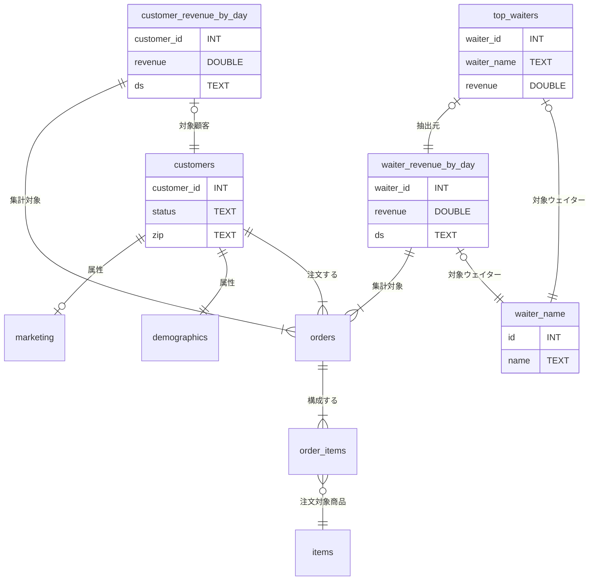

# はじめに
少し前の「[SQLMesh入門](https://zenn.dev/robon/articles/c8928f88f62218)」の「おわりに」でこんなことを書きました。
> 公式サイトを含めて、サンプルやトレーニング用の教材が少なく、作者の意図がわかりにくいように思います。

いろいろ探した結果、公式のリポジトリの「これ↓」が、いいんじゃないかな？
ということで紹介してみます。

https://github.com/TobikoData/sqlmesh-examples

# やってみた（001_shushi/1_simple）
まず、このサンプルの背景ですが、寿司レストランのデータを分析するというユースケースです。Tobiko 社の名前は寿司ネタのトビコとのことです。

## 外部モデル
業務システムから以下の５つのテーブルが「raw」スキーマにロードされているところからスタートします。


顧客は２つに分かれてますけど、来店したら `status` が `ACTIVE` になったり、引っ越したら `zip` が変わったりするので管理しているシステムが違うのかもしれません。
`orders` テーブルと `order_item` テーブルは、トランザクションなので、業務ではリアルタイムで、DWH には一定間隔で追加されていくと考えてよさそうです。
お寿司のネタなので、`items` テーブルの `price` の値は、時価ということで、これも日々追加されていくというシナリオなのでしょう。

これらは外部モデルなので、`external_models.yaml` でテーブル名、カラム名、データ型を定義しています。コメントは、[sushi-overview.ipynb](https://github.com/TobikoData/sqlmesh-examples/blob/main/001_sushi/sushi-overview.ipynb) のものを意訳しました。

```yaml: external_models.yaml
- name: raw.demographics
  columns:
    id: INT
    customer_id: INT
    zip: TEXT
- name: raw.items
  columns:
    id: INT
    name: TEXT
    price: DOUBLE
    ds: TEXT
- name: raw.marketing
  columns:
    id: INT
    customer_id: INT
    status: TEXT
- name: raw.order_items
  columns:
    id: INT
    order_id: INT
    item_id: INT
    quantity: INT
    ds: TEXT
- name: raw.orders
  columns:
    id: INT
    customer_id: INT
    waiter_id: INT
    start_ts: INT
    end_ts: INT
    ds: TEXT
```

## モデル
### waiter_names
`order.waiter_id` として（おそらく業務システム上は社員マスターのものが）参照されていますが、こちらは（限定されたウェイターさんだけが対象ということか） SEED のサンプルになってます。

```sql: models/waiter_names.sql
-- Seed data containing water names.
MODEL (
  name sushisimple.waiter_names,
  kind SEED (
    path '../seeds/waiter_names.csv'
  ),
  columns (
    id INT,
    name TEXT
  ),
  grain id
)
```
```csv: seeds/waiter_names.csv
id,name
0,Toby
1,Tyson
2,Ryan
3,George
4,Chris
5,Max
6,Vincent
7,Iaroslav
8,Emma
9,Maia
```

### customers
やはり `customers` が割れているのはイマイチなので、`orders` してくれた顧客を VIEW で用意しています。

```sql: models/customer.sql
-- View of customer data.
MODEL (
  name sushisimple.customers,
  kind VIEW,
  cron '@daily',
  grain customer_id,
);

SELECT DISTINCT
  o.customer_id::INT AS customer_id,
  COALESCE(m.status, 'UNKNOWN')::TEXT AS status,
  d.zip::TEXT as zip
FROM raw.orders AS o
LEFT JOIN raw.marketing AS m
    ON o.customer_id = m.customer_id
LEFT JOIN raw.demographics AS d
    ON o.customer_id = d.customer_id
```

### customer_revenue_by_day
顧客あたり、日別の売り上げを VIEW で求めます。CTE で `order_total` を求めてから、日別、顧客別の合計を作ります。

```sql: models/customer_revenue_by_day.sql
-- View of revenue from customers by day.
MODEL (
  name sushisimple.customer_revenue_by_day,
  kind VIEW,
  cron '@daily',
  grain (customer_id, ds),
);

WITH order_total AS (
  SELECT
    oi.order_id AS order_id,
    SUM(oi.quantity * i.price) AS total,
    oi.ds AS ds
  FROM raw.order_items AS oi
  LEFT JOIN raw.items AS i
    ON oi.item_id = i.id AND oi.ds = i.ds
  GROUP BY
    oi.order_id,
    oi.ds
)
SELECT
  o.customer_id::INT AS customer_id, /* Customer id */
  SUM(ot.total)::DOUBLE AS revenue, /* Revenue from orders made by this customer */
  o.ds::TEXT AS ds /* Date */
FROM raw.orders AS o
LEFT JOIN order_total AS ot
  ON o.id = ot.order_id AND o.ds = ot.ds
GROUP BY
  o.customer_id,
  o.ds
```

### waiter_revenue_by_day
こちらはウェイターさんあたりの売り上げですが、CTE なしです。さっきのは、顧客が多いという想定か、CTE のサンプルを作りたかったのかもしれませんね。再利用するなら `order_total` も VIEW でモデルにしておくのもありでしょう。

```sql: models/water_revenue_by_day.sql
-- View of revenue generated by each waiter by day.
MODEL (
  name sushisimple.waiter_revenue_by_day,
  kind VIEW,
  cron '@daily',
  grain (waiter_id, ds)
);

SELECT
  o.waiter_id::INT AS waiter_id, -- Waiter id
  SUM(oi.quantity * i.price)::DOUBLE AS revenue, -- Revenue from orders taken by this waiter
  o.ds::TEXT AS ds -- Order date
FROM raw.orders AS o
LEFT JOIN raw.order_items AS oi
  ON o.id = oi.order_id AND o.ds = oi.ds
LEFT JOIN raw.items AS i
  ON oi.item_id = i.id AND oi.ds = i.ds
GROUP BY
  o.waiter_id,
  o.ds
```

### top_waiters
直近の日付のウェイター別売り上げトップ10です。

```sql: models/top_waiters.sql
-- View of 10 waiters with highest revenue on most recent day of data.
MODEL (
  name sushisimple.top_waiters,
  kind VIEW,
  cron '@daily',
  grain waiter_id
);

SELECT
  waiter_id::INT AS waiter_id,
  name::TEXT AS waiter_name,
  revenue::DOUBLE AS revenue
FROM sushisimple.waiter_revenue_by_day as r
LEFT JOIN sushisimple.waiter_names AS n
  ON r.waiter_id = n.id
WHERE
  ds = (
    SELECT
      MAX(ds)
    FROM sushisimple.waiter_revenue_by_day
  )
ORDER BY
  revenue DESC
LIMIT 10
```

### ERD
まぁ、積み重ねた VIEW なので、なんちゃって ER 図ですが。



## 動かす前に
### Setup
[README.md](https://github.com/TobikoData/sqlmesh-examples/blob/main/README.md) の `Setup` のようにやっても良いのですが、最近は、すっかり `uv` 派なので、`uv` 前提でセットアップします。

```
cd sqlmesh-examples
uv init --bare
uv venv
uv add sqlmesh
```

### DuckDB
まさに、動かす前に、DuckDB の中身を確認しておきます。
```
$ duckdb 001_sushi/1_simple/db/sushi-example.db 
v1.2.1 8e52ec4395
Enter ".help" for usage hints.
D select database_name  from duckdb_databases() where internal = false;
┌───────────────┐
│ database_name │
│    varchar    │
├───────────────┤
│ sushi-example │
└───────────────┘
D select schema_name from duckdb_schemas() where database_name = 'sushi-example';
┌─────────────┐
│ schema_name │
│   varchar   │
├─────────────┤
│ main        │
│ raw         │
└─────────────┘
D select table_name from duckdb_tables() where schema_name = 'raw';
┌──────────────┐
│  table_name  │
│   varchar    │
├──────────────┤
│ demographics │
│ items        │
│ marketing    │
│ orders       │
│ order_items  │
└──────────────┘
D select view_name from duckdb_views() where schema_name = 'raw';
┌───────────┐
│ view_name │
│  varchar  │
├───────────┤
│  0 rows   │
└───────────┘
D select table_name, column_name, comment, data_type from duckdb_columns() where schema_name = 'raw';
┌──────────────┬─────────────┬─────────┬───────────┐
│  table_name  │ column_name │ comment │ data_type │
│   varchar    │   varchar   │ varchar │  varchar  │
├──────────────┼─────────────┼─────────┼───────────┤
│ demographics │ id          │ NULL    │ INTEGER   │
│ demographics │ customer_id │ NULL    │ INTEGER   │
│ demographics │ zip         │ NULL    │ VARCHAR   │
│ items        │ id          │ NULL    │ INTEGER   │
│ items        │ name        │ NULL    │ VARCHAR   │
│ items        │ price       │ NULL    │ DOUBLE    │
│ items        │ ds          │ NULL    │ DATE      │
│ marketing    │ id          │ NULL    │ INTEGER   │
│ marketing    │ customer_id │ NULL    │ INTEGER   │
│ marketing    │ status      │ NULL    │ VARCHAR   │
│ orders       │ id          │ NULL    │ INTEGER   │
│ orders       │ customer_id │ NULL    │ INTEGER   │
│ orders       │ waiter_id   │ NULL    │ INTEGER   │
│ orders       │ start_ts    │ NULL    │ INTEGER   │
│ orders       │ end_ts      │ NULL    │ INTEGER   │
│ orders       │ ds          │ NULL    │ DATE      │
│ order_items  │ id          │ NULL    │ INTEGER   │
│ order_items  │ order_id    │ NULL    │ INTEGER   │
│ order_items  │ item_id     │ NULL    │ INTEGER   │
│ order_items  │ quantity    │ NULL    │ INTEGER   │
│ order_items  │ ds          │ NULL    │ DATE      │
├──────────────┴─────────────┴─────────┴───────────┤
│ 21 rows                                4 columns │
└──────────────────────────────────────────────────┘
D .q
```

## 動かす
### sqlmesh plan
`config.yaml` のあるプロジェクトへ移動して、`sqlmesh plan` します。

```
$ cd 001_sushi/1_simple/
$ uv run sqlmesh plan
Initializing new project state...

`prod` environment will be initialized

Models:
└── Added:
    ├── raw.demographics
    ├── raw.items
    ├── raw.marketing
    ├── raw.order_items
    ├── raw.orders
    ├── sushisimple.customer_revenue_by_day
    ├── sushisimple.customers
    ├── sushisimple.top_waiters
    ├── sushisimple.waiter_names
    └── sushisimple.waiter_revenue_by_day
Models needing backfill:
├── sushisimple.customer_revenue_by_day: [recreate view]
├── sushisimple.customers: [recreate view]
├── sushisimple.top_waiters: [recreate view]
├── sushisimple.waiter_names: [full refresh]
└── sushisimple.waiter_revenue_by_day: [recreate view]
Apply - Backfill Tables [y/n]: y
[1/1] sushisimple.customer_revenue_by_day   [recreate view]                               0.04s   
[1/1] sushisimple.customers                 [recreate view]                               0.03s   
[1/1] sushisimple.waiter_names              [insert seed file]                            0.04s   
[1/1] sushisimple.waiter_revenue_by_day     [recreate view]                               0.04s   
[1/1] sushisimple.top_waiters               [recreate view]                               0.03s   
Executing model batches ━━━━━━━━━━━━━━━━━━━━━━━━━━━━━━━━━━━━━━━━ 100.0% • 5/5 • 0:00:00                                                           
                                                                                                                                                  
✔ Model batches executed

Updating virtual layer  ━━━━━━━━━━━━━━━━━━━━━━━━━━━━━━━━━━━━━━━━ 100.0% • 5/5 • 0:00:00

✔ Virtual layer updated

```

### DuckDB
「動かす前に」と同様に上から
```
$ duckdb db/sushi-example.db 
v1.2.1 8e52ec4395
Enter ".help" for usage hints.
D select schema_name from duckdb_schemas() where database_name = 'sushi-example';
┌──────────────────────┐
│     schema_name      │
│       varchar        │
├──────────────────────┤
│ main                 │
│ raw                  │
│ sqlmesh              │
│ sqlmesh__sushisimple │
│ sushisimple          │
└──────────────────────┘
D select schema_name, table_name from duckdb_tables() where schema_name <> 'main';
┌──────────────────────┬───────────────────────────────────────┐
│     schema_name      │              table_name               │
│       varchar        │                varchar                │
├──────────────────────┼───────────────────────────────────────┤
│ raw                  │ demographics                          │
│ raw                  │ items                                 │
│ raw                  │ marketing                             │
│ raw                  │ orders                                │
│ raw                  │ order_items                           │
│ sqlmesh              │ _auto_restatements                    │
│ sqlmesh              │ _environments                         │
│ sqlmesh              │ _environment_statements               │
│ sqlmesh              │ _intervals                            │
│ sqlmesh              │ _snapshots                            │
│ sqlmesh              │ _versions                             │
│ sqlmesh__sushisimple │ sushisimple__waiter_names__3510154461 │
├──────────────────────┴───────────────────────────────────────┤
│ 12 rows                                            2 columns │
└──────────────────────────────────────────────────────────────┘
D select schema_name, view_name from duckdb_views() where database_name = 'sushi-example' and schema_name <> 'main';
┌──────────────────────┬──────────────────────────────────────────────────┐
│     schema_name      │                    view_name                     │
│       varchar        │                     varchar                      │
├──────────────────────┼──────────────────────────────────────────────────┤
│ sqlmesh__sushisimple │ sushisimple__customers__417166203                │
│ sqlmesh__sushisimple │ sushisimple__customer_revenue_by_day__1188378195 │
│ sqlmesh__sushisimple │ sushisimple__top_waiters__381189255              │
│ sqlmesh__sushisimple │ sushisimple__waiter_revenue_by_day__157094348    │
│ sushisimple          │ customers                                        │
│ sushisimple          │ customer_revenue_by_day                          │
│ sushisimple          │ top_waiters                                      │
│ sushisimple          │ waiter_names                                     │
│ sushisimple          │ waiter_revenue_by_day                            │
└──────────────────────┴──────────────────────────────────────────────────┘
D select table_name, column_name, comment, data_type from duckdb_columns() where schema_name = 'sqlmesh__sushisimple';
┌──────────────────────────────────────────────────┬─────────────┬───────────────────────────────────────────┬───────────┐
│                    table_name                    │ column_name │                  comment                  │ data_type │
│                     varchar                      │   varchar   │                  varchar                  │  varchar  │
├──────────────────────────────────────────────────┼─────────────┼───────────────────────────────────────────┼───────────┤
│ sushisimple__customers__417166203                │ customer_id │ NULL                                      │ INTEGER   │
│ sushisimple__customers__417166203                │ status      │ NULL                                      │ VARCHAR   │
│ sushisimple__customers__417166203                │ zip         │ NULL                                      │ VARCHAR   │
│ sushisimple__customer_revenue_by_day__1188378195 │ customer_id │ Customer id                               │ INTEGER   │
│ sushisimple__customer_revenue_by_day__1188378195 │ revenue     │ Revenue from orders made by this customer │ DOUBLE    │
│ sushisimple__customer_revenue_by_day__1188378195 │ ds          │ Date                                      │ VARCHAR   │
│ sushisimple__top_waiters__381189255              │ waiter_id   │ NULL                                      │ INTEGER   │
│ sushisimple__top_waiters__381189255              │ waiter_name │ NULL                                      │ VARCHAR   │
│ sushisimple__top_waiters__381189255              │ revenue     │ NULL                                      │ DOUBLE    │
│ sushisimple__waiter_names__3510154461            │ id          │ NULL                                      │ INTEGER   │
│ sushisimple__waiter_names__3510154461            │ name        │ NULL                                      │ VARCHAR   │
│ sushisimple__waiter_revenue_by_day__157094348    │ waiter_id   │ Waiter id                                 │ INTEGER   │
│ sushisimple__waiter_revenue_by_day__157094348    │ revenue     │ Revenue from orders taken by this waiter  │ DOUBLE    │
│ sushisimple__waiter_revenue_by_day__157094348    │ ds          │ Order date                                │ VARCHAR   │
├──────────────────────────────────────────────────┴─────────────┴───────────────────────────────────────────┴───────────┤
│ 14 rows                                                                                                      4 columns │
└────────────────────────────────────────────────────────────────────────────────────────────────────────────────────────┘
D select table_name, column_name, comment, data_type from duckdb_columns() where schema_name = 'sushisimple';
┌─────────────────────────┬─────────────┬───────────────────────────────────────────┬───────────┐
│       table_name        │ column_name │                  comment                  │ data_type │
│         varchar         │   varchar   │                  varchar                  │  varchar  │
├─────────────────────────┼─────────────┼───────────────────────────────────────────┼───────────┤
│ customers               │ customer_id │ NULL                                      │ INTEGER   │
│ customers               │ status      │ NULL                                      │ VARCHAR   │
│ customers               │ zip         │ NULL                                      │ VARCHAR   │
│ customer_revenue_by_day │ customer_id │ Customer id                               │ INTEGER   │
│ customer_revenue_by_day │ revenue     │ Revenue from orders made by this customer │ DOUBLE    │
│ customer_revenue_by_day │ ds          │ Date                                      │ VARCHAR   │
│ top_waiters             │ waiter_id   │ NULL                                      │ INTEGER   │
│ top_waiters             │ waiter_name │ NULL                                      │ VARCHAR   │
│ top_waiters             │ revenue     │ NULL                                      │ DOUBLE    │
│ waiter_names            │ id          │ NULL                                      │ INTEGER   │
│ waiter_names            │ name        │ NULL                                      │ VARCHAR   │
│ waiter_revenue_by_day   │ waiter_id   │ Waiter id                                 │ INTEGER   │
│ waiter_revenue_by_day   │ revenue     │ Revenue from orders taken by this waiter  │ DOUBLE    │
│ waiter_revenue_by_day   │ ds          │ Order date                                │ VARCHAR   │
├─────────────────────────┴─────────────┴───────────────────────────────────────────┴───────────┤
│ 14 rows                                                                             4 columns │
└───────────────────────────────────────────────────────────────────────────────────────────────┘
D .q
```

上から順に、
スキーマは３つ追加されました。
- `sqlmesh` は、sqlmesh の状態データベースです。
- `sqlmesh__sushisimple` は、`sushisimple` プロジェクトの物理レイヤです。
- `suchisimple` は、`prod` 環境の論理レイヤです。

テーブルは、状態データベースに６つ、物理レイヤに SEED の `waiter_names` に相当するものが１つ追加されました。状態データベースは、後から、詳細をみることにします。

ビューは、それぞれモデルに相当するものが、物理レイヤに４つ、論理レイヤに５つ追加されました。物理レイヤが１つ少ないのは、１つが SEED でテーブルになっているからです。

次に、物理レイヤのカラムですが、こちらはモデルのとおりです。モデルのカラムにインラインでコメントされていた内容が、DuckDB のカラムコメントにも残されています。

最後は、論理レイヤのカラムですが、物理レイヤの別名の関係になりますので、コメントを含めて同じです。

### 状態データベース
状態データベースの６つのテーブルについて見ていきましょう。

#### _auto_restatements
この時点では空でした。
```
D select * from sqlmesh._auto_restatements;
┌───────────────┬──────────────────┬──────────────────────────┐
│ snapshot_name │ snapshot_version │ next_auto_restatement_ts │
│    varchar    │     varchar      │          int64           │
├───────────────┴──────────────────┴──────────────────────────┤
│                           0 rows                            │
└─────────────────────────────────────────────────────────────┘
```

#### _environments
1レコードですが、15カラムあるので、CSV に export して、転置します。export は、以下のようにやります。
```
D copy sqlmesh._environments to '_environments.csv' (header, delimiter ',');
```

| 項目 | 値 |
|---|---|
| name | prod |
| snapshots | 長い JSON 文字列なので、下記へ |
| start_at | 2025-10-07 00:00:00 |
| end_at |  |
| plan_id | 0d2e4bf9844c4407a00230429f4a47c2 |
| previous_plan_id |  |
| expiration_ts |  |
| finalized_ts | 1759890044886 |
| promoted_snapshot_ids |  |
| suffix_target | schema |
| catalog_name_override |  |
| previous_finalized_snapshots | [] |
| normalize_name | true |
| requirements | {} |
| gateway_managed | false |

```json: _environments.snapshot
[
  {
    "name": "\"sushi-example\".\"sushisimple\".\"customers\"",
    "dev_version": "417166203",
    "change_category": 1,
    "fingerprint": {
      "data_hash": "3649155621",
      "metadata_hash": "54374572",
      "parent_data_hash": "3540115527",
      "parent_metadata_hash": "36623728"
    },
    "previous_versions": [],
    "dev_table_suffix": "dev",
    "table_naming_convention": "schema_and_table",
    "forward_only": false,
    "version": "417166203",
    "physical_schema": "sqlmesh__sushisimple",
    "parents": [
      {
        "name": "\"sushi-example\".\"raw\".\"demographics\"",
        "identifier": "1112628036"
      },
      {
        "name": "\"sushi-example\".\"raw\".\"orders\"",
        "identifier": "4177358286"
      },
      {
        "name": "\"sushi-example\".\"raw\".\"marketing\"",
        "identifier": "951266748"
      }
    ],
    "kind_name": "VIEW",
    "node_type": "model",
    "virtual_environment_mode": "full"
  },
  {
    "name": "\"sushi-example\".\"sushisimple\".\"waiter_revenue_by_day\"",
    "dev_version": "157094348",
    "change_category": 1,
    "fingerprint": {
      "data_hash": "1974234594",
      "metadata_hash": "338732671",
      "parent_data_hash": "2615392153",
      "parent_metadata_hash": "36623728"
    },
    "previous_versions": [],
    "dev_table_suffix": "dev",
    "table_naming_convention": "schema_and_table",
    "forward_only": false,
    "version": "157094348",
    "physical_schema": "sqlmesh__sushisimple",
    "parents": [
      {
        "name": "\"sushi-example\".\"raw\".\"orders\"",
        "identifier": "4177358286"
      },
      {
        "name": "\"sushi-example\".\"raw\".\"items\"",
        "identifier": "4057945501"
      },
      {
        "name": "\"sushi-example\".\"raw\".\"order_items\"",
        "identifier": "2963435990"
      }
    ],
    "kind_name": "VIEW",
    "node_type": "model",
    "virtual_environment_mode": "full"
  },
  {
    "name": "\"sushi-example\".\"sushisimple\".\"waiter_names\"",
    "dev_version": "3510154461",
    "change_category": 1,
    "fingerprint": {
      "data_hash": "4220286235",
      "metadata_hash": "1646615025",
      "parent_data_hash": "0",
      "parent_metadata_hash": "0"
    },
    "previous_versions": [],
    "dev_table_suffix": "dev",
    "table_naming_convention": "schema_and_table",
    "forward_only": false,
    "version": "3510154461",
    "physical_schema": "sqlmesh__sushisimple",
    "parents": [],
    "kind_name": "SEED",
    "node_type": "model",
    "virtual_environment_mode": "full"
  },
  {
    "name": "\"sushi-example\".\"sushisimple\".\"customer_revenue_by_day\"",
    "dev_version": "1188378195",
    "change_category": 1,
    "fingerprint": {
      "data_hash": "1699790014",
      "metadata_hash": "3913364503",
      "parent_data_hash": "2615392153",
      "parent_metadata_hash": "36623728"
    },
    "previous_versions": [],
    "dev_table_suffix": "dev",
    "table_naming_convention": "schema_and_table",
    "forward_only": false,
    "version": "1188378195",
    "physical_schema": "sqlmesh__sushisimple",
    "parents": [
      {
        "name": "\"sushi-example\".\"raw\".\"orders\"",
        "identifier": "4177358286"
      },
      {
        "name": "\"sushi-example\".\"raw\".\"items\"",
        "identifier": "4057945501"
      },
      {
        "name": "\"sushi-example\".\"raw\".\"order_items\"",
        "identifier": "2963435990"
      }
    ],
    "kind_name": "VIEW",
    "node_type": "model",
    "virtual_environment_mode": "full"
  },
  {
    "name": "\"sushi-example\".\"sushisimple\".\"top_waiters\"",
    "dev_version": "381189255",
    "change_category": 1,
    "fingerprint": {
      "data_hash": "2591817560",
      "metadata_hash": "460664824",
      "parent_data_hash": "1999905133",
      "parent_metadata_hash": "737318949"
    },
    "previous_versions": [],
    "dev_table_suffix": "dev",
    "table_naming_convention": "schema_and_table",
    "forward_only": false,
    "version": "381189255",
    "physical_schema": "sqlmesh__sushisimple",
    "parents": [
      {
        "name": "\"sushi-example\".\"sushisimple\".\"waiter_revenue_by_day\"",
        "identifier": "2200766198"
      },
      {
        "name": "\"sushi-example\".\"sushisimple\".\"waiter_names\"",
        "identifier": "1509510622"
      }
    ],
    "kind_name": "VIEW",
    "node_type": "model",
    "virtual_environment_mode": "full"
  },
  {
    "name": "\"sushi-example\".\"raw\".\"demographics\"",
    "dev_version": "3906394976",
    "change_category": 1,
    "fingerprint": {
      "data_hash": "2544791803",
      "metadata_hash": "1551791906",
      "parent_data_hash": "0",
      "parent_metadata_hash": "0"
    },
    "previous_versions": [],
    "dev_table_suffix": "dev",
    "table_naming_convention": "schema_and_table",
    "forward_only": false,
    "version": "3906394976",
    "physical_schema": "sqlmesh__raw",
    "parents": [],
    "kind_name": "EXTERNAL",
    "node_type": "model",
    "virtual_environment_mode": "full"
  },
  {
    "name": "\"sushi-example\".\"raw\".\"items\"",
    "dev_version": "3791312541",
    "change_category": 1,
    "fingerprint": {
      "data_hash": "1248473033",
      "metadata_hash": "1551791906",
      "parent_data_hash": "0",
      "parent_metadata_hash": "0"
    },
    "previous_versions": [],
    "dev_table_suffix": "dev",
    "table_naming_convention": "schema_and_table",
    "forward_only": false,
    "version": "3791312541",
    "physical_schema": "sqlmesh__raw",
    "parents": [],
    "kind_name": "EXTERNAL",
    "node_type": "model",
    "virtual_environment_mode": "full"
  },
  {
    "name": "\"sushi-example\".\"raw\".\"marketing\"",
    "dev_version": "1833826140",
    "change_category": 1,
    "fingerprint": {
      "data_hash": "3084179100",
      "metadata_hash": "1551791906",
      "parent_data_hash": "0",
      "parent_metadata_hash": "0"
    },
    "previous_versions": [],
    "dev_table_suffix": "dev",
    "table_naming_convention": "schema_and_table",
    "forward_only": false,
    "version": "1833826140",
    "physical_schema": "sqlmesh__raw",
    "parents": [],
    "kind_name": "EXTERNAL",
    "node_type": "model",
    "virtual_environment_mode": "full"
  },
  {
    "name": "\"sushi-example\".\"raw\".\"order_items\"",
    "dev_version": "490972095",
    "change_category": 1,
    "fingerprint": {
      "data_hash": "1013284553",
      "metadata_hash": "1551791906",
      "parent_data_hash": "0",
      "parent_metadata_hash": "0"
    },
    "previous_versions": [],
    "dev_table_suffix": "dev",
    "table_naming_convention": "schema_and_table",
    "forward_only": false,
    "version": "490972095",
    "physical_schema": "sqlmesh__raw",
    "parents": [],
    "kind_name": "EXTERNAL",
    "node_type": "model",
    "virtual_environment_mode": "full"
  },
  {
    "name": "\"sushi-example\".\"raw\".\"orders\"",
    "dev_version": "3608433385",
    "change_category": 1,
    "fingerprint": {
      "data_hash": "2091497075",
      "metadata_hash": "1551791906",
      "parent_data_hash": "0",
      "parent_metadata_hash": "0"
    },
    "previous_versions": [],
    "dev_table_suffix": "dev",
    "table_naming_convention": "schema_and_table",
    "forward_only": false,
    "version": "3608433385",
    "physical_schema": "sqlmesh__raw",
    "parents": [],
    "kind_name": "EXTERNAL",
    "node_type": "model",
    "virtual_environment_mode": "full"
  }
]
```

#### _environment_statements
この時点では空でした。
```
D select * from sqlmesh._environment_statements;
┌──────────────────┬─────────┬────────────────────────┐
│ environment_name │ plan_id │ environment_statements │
│     varchar      │ varchar │        varchar         │
├──────────────────┴─────────┴────────────────────────┤
│                       0 rows                        │
└─────────────────────────────────────────────────────┘
```

#### _intervals
5レコード、13カラムあるので、CSV に export して、転置します。

#### _snapshots
10レコード、12カラムあるので、CSV に export 

#### _versions
これは、SQLMesh 自体のバージョンアップとマイグレーション用と思います。
```
D select * from sqlmesh._versions;
┌────────────────┬─────────────────┬─────────────────┐
│ schema_version │ sqlglot_version │ sqlmesh_version │
│     int32      │     varchar     │     varchar     │
├────────────────┼─────────────────┼─────────────────┤
│       99       │ 27.19.0         │ 0.224.0         │
└────────────────┴─────────────────┴─────────────────┘
```


# おわりに

