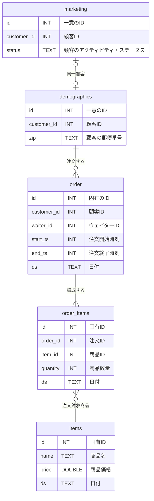

# はじめに
少し前の「[SQLMesh入門](https://zenn.dev/robon/articles/c8928f88f62218)」の「おわりに」でこんなことを書きました。
> 公式サイトを含めて、サンプルやトレーニング用の教材が少なく、作者の意図がわかりにくいように思います。

いろいろ探した結果、公式のリポジトリの「これ↓」が、いいんじゃないかな？ということで紹介してみます。

https://github.com/TobikoData/sqlmesh-examples

# やってみた
## 背景
まず、このサンプルの背景ですが、寿司レストランのデータを分析するというユースケースです。
業務システムから以下の５つのテーブルが「raw」スキーマにロードされているところからスタートします。



顧客は２つに分かれてますけど、来店したら status が ACTIVE になったり、引っ越したら zip が変わったりするので管理しているシステムが違うのかもしれません。
order と order_item は、トランザクションなので、日々追加されていきます。
お寿司のネタなので、items は、時価ということで、これも日々追加されていくというシナリオなのでしょう。

## モデル
### waiter_names
order.waiter_id ですが、こちらは SEED のサンプルになってます。

```sql: models/waiter_names.sql
-- Seed data containing water names.
MODEL (
  name sushisimple.waiter_names,
  kind SEED (
    path '../seeds/waiter_names.csv'
  ),
  columns (
    id INT,
    name TEXT
  ),
  grain id
)
```
```csv: seeds/waiter_names.csv
id,name
0,Toby
1,Tyson
2,Ryan
3,George
4,Chris
5,Max
6,Vincent
7,Iaroslav
8,Emma
9,Maia
```


# おわりに

