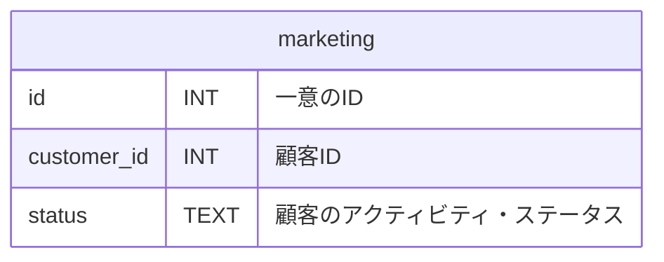

# はじめに
少し前の「[SQLMesh入門](https://zenn.dev/robon/articles/c8928f88f62218)」の「おわりに」でこんなことを書きました。
> 公式サイトを含めて、サンプルやトレーニング用の教材が少なく、作者の意図がわかりにくいように思います。

いろいろ探した結果、公式のリポジトリの「これ↓」が、いいんじゃないかな？ということで紹介してみます。

https://github.com/TobikoData/sqlmesh-examples

# やってみた
## 背景
まず、このサンプルの背景ですが、寿司レストランのデータを分析するというユースケースです。
業務システムから５つのテーブルが「raw」スキーマにロードされているところからスタートします。

# おわりに

