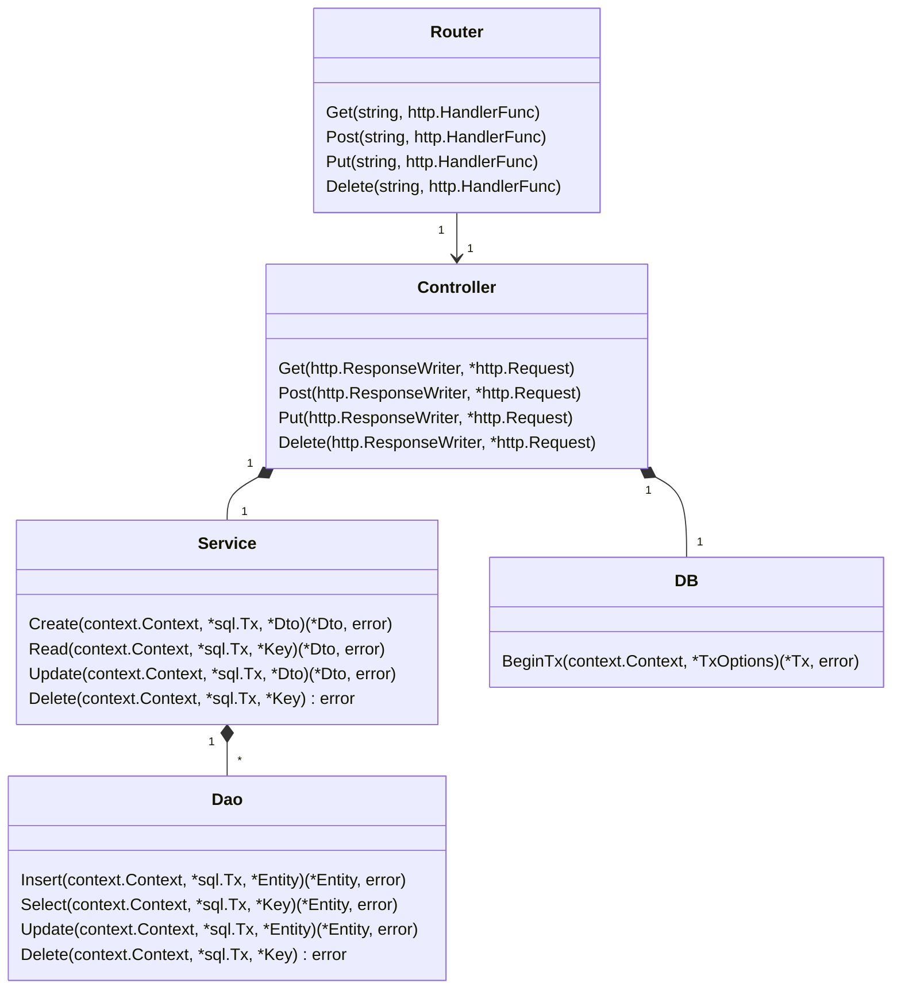

# はじめに

NestJS、FastAPIに続いて、GolangでもRESTサーバーを開発しましたという記事です。過去の記事は、以下から参照ください。

https://zenn.dev/robon/articles/76d4ec767b72ae

https://zenn.dev/robon/articles/aa7ba513b3bdb3

# 設計
## ライブラリやフレームワーク

NestJSやFastAPIについては、フレームワークありきで実装してきましたが、Golangの場合は、まずは、できるだけ標準ライブラリでいきたかったのですが、実装してみて、パスパラメータやルーティングの構成を自力でやるのは、なかなか大変そうに感じたので、go-chiだけは使わせてもらうことにしました。

https://github.com/go-chi/chi

また、データベースも上記のNestJS、FastAPIの際と同じPostgeSQLを使用します。

## 構造

GolangにはClassは無いので、Class図というのも変かもしれませんが、NestJSに影響されて（笑）、上記のNestJSやFastAPIの実装に近い構造にしました。RESTリソース単位に以下のセットを追加していくことにします。



# 実装
## 環境

別件で使用中の環境で実装しました。

```bash
$ go version
go version go1.18.6 linux/amd64
```

```go-mod: go.mod
module github.com/take0a/go-rest-sample

go 1.18

require (
	github.com/go-chi/chi/v5 v5.0.8
	github.com/go-chi/render v1.0.2
	github.com/lib/pq v1.10.7
)

require github.com/ajg/form v1.5.1 // indirect
```

## データ構造

RESTリソースをJSONで入出力するデータ構造は、DTO（Data Transfer Object）という命名規則にしました。DTOにはJSONタグを付与します。また、複合キーのケースも想定して主キーも構造体にしました。

データベースと入出力するデータ構造は、Entityという命名規則にしました。今回の場合は、基本的にほぼ同じ型になるのですが、相互に変換するための処理を実装します。

```go: module/customers/dto.go
package customers

// Key は、顧客リソースの主キー
type Key struct {
	CustomerID int
}

// Dto は、顧客リソース
type Dto struct {
	CustomerID int    `json:"customerId"`
	Name       string `json:"name"`
	Address    string `json:"address"`
}

// NewDto は、Customer から CustomerDto を生成する
func NewDto(customer *Entity) *Dto {
	return &Dto{
		CustomerID: customer.CustomerID,
		Name:       customer.Name,
		Address:    customer.Address,
	}
}

// Key は、Dto の Key を生成する。
func (c *Dto) Key() *Key {
	return &Key{
		CustomerID: c.CustomerID,
	}
}
```

```go: module/customers/entity.go
package customers

// Entity は、CUSTOMER テーブルに対応するエンティティ
type Entity struct {
	CustomerID int
	Name       string
	Address    string
}

// NewEntity は、Dto から Entity を生成する
func NewEntity(dto *Dto) *Entity {
	return &Entity{
		CustomerID: dto.CustomerID,
		Name:       dto.Name,
		Address:    dto.Address,
	}
}
```

名前があっさりしているのは、Golangの場合、パッケージ名＋要素でアクセスすることが多いこともあって、パッケージ名を含めた名前を公開するとlinterに注意されたりしますし、短い単語を使うのがGolangらしいかなということで、Golangに馴染みのない方からすると違和感満載かもしれません。

また、識別子の多くが大文字で始まっていてパッケージ外に公開されているのは、いろいろと試行錯誤している途中の段階でもあり、最適ではありません。

## DAO（Data Access Object）

DTOといい、Javaの香りがするかもしれませんが、これは、エンタープライズアプリケーションアーキテクチャパターンのテーブルデータゲートウェイパターンなのだ。と言ってもDAOの方が通りが良いような気がしたので、DAOにします。

https://www.martinfowler.com/eaaCatalog/tableDataGateway.html

```go: module/customers/dao.go
package customers

import (
	"context"
	"database/sql"
	"log"

	"github.com/lib/pq"
	"github.com/take0a/go-rest-sample/utils"
)

// SQL文
const (
	Insert = `
INSERT INTO CUSTOMER (
CUSTOMER_ID, NAME, ADDRESS
) VALUES (
$1, $2, $3
)`
	Select = `
SELECT
CUSTOMER_ID, NAME, ADDRESS
FROM CUSTOMER
WHERE CUSTOMER_ID = $1`
	Update = `
UPDATE CUSTOMER SET
CUSTOMER_ID = $1, 
NAME = $2,
ADDRESS = $3
WHERE CUSTOMER_ID = $1`
	Delete = `
DELETE FROM CUSTOMER
WHERE CUSTOMER_ID = $1`
)

// Dao は、Customer の Table Data Gateway
type Dao struct{}

// Insert は、指定された Customer を登録する。
func (d *Dao) Insert(ctx context.Context, tx *sql.Tx, entity *Entity) (*Entity, error) {
	_, err := tx.ExecContext(ctx, Insert,
		entity.CustomerID,
		entity.Name,
		entity.Address,
	)
	if err != nil {
		if pqErr, ok := err.(*pq.Error); ok {
			if pqErr.Code == "23505" { // unique_violation
				return nil, utils.ErrConflict
			}
		}
		log.Printf("%s %s\n", Insert, err)
		return nil, err
	}
	return entity, nil
}

// Select は、指定されたキーの Customer を取得する。
func (d *Dao) Select(ctx context.Context, tx *sql.Tx, key *Key) (*Entity, error) {
	var entity Entity
	err := tx.QueryRowContext(ctx, Select,
		key.CustomerID,
	).Scan(
		&entity.CustomerID,
		&entity.Name,
		&entity.Address,
	)
	if err != nil {
		// レコードが存在しない場合は、sql.ErrNoRows
		log.Printf("%s Query %s\n", Select, err)
		return nil, err
	}
	return &entity, nil
}

// Update は、指定された Customer を更新する。
func (d *Dao) Update(ctx context.Context, tx *sql.Tx, entity *Entity) (*Entity, error) {
	result, err := tx.ExecContext(ctx, Update,
		entity.CustomerID,
		entity.Name,
		entity.Address,
	)
	if err != nil {
		log.Printf("%s Exec %s\n", Update, err)
		return nil, err
	}
	num, err := result.RowsAffected()
	if err != nil {
		log.Printf("%s RowsAffected %s\n", Update, err)
		return nil, err
	}
	if num == 0 {
		log.Printf("Not Found %#v", entity)
		return nil, sql.ErrNoRows
	}
	return entity, nil
}

// Delete は、指定されたキーの Customer を削除する。
func (d *Dao) Delete(ctx context.Context, tx *sql.Tx, key *Key) error {
	result, err := tx.ExecContext(ctx, Delete,
		key.CustomerID,
	)
	if err != nil {
		log.Printf("%s %s\n", Delete, err)
		return err
	}
	num, err := result.RowsAffected()
	if err != nil {
		log.Printf("%s RowsAffected %s\n", Delete, err)
		return err
	}
	if num == 0 {
		log.Printf("Not Found %#v", key)
		return sql.ErrNoRows
	}
	return nil
}
```

という感じで、上位で作られたコンテキスト（context.Context）とトランザクション（sql.Tx）上でSQL文を実行します。

# 次回は

Daoを呼び出すServiceから呼び出し元へ向けて続けます。

https://zenn.dev/robon/articles/a81cc526cac283
